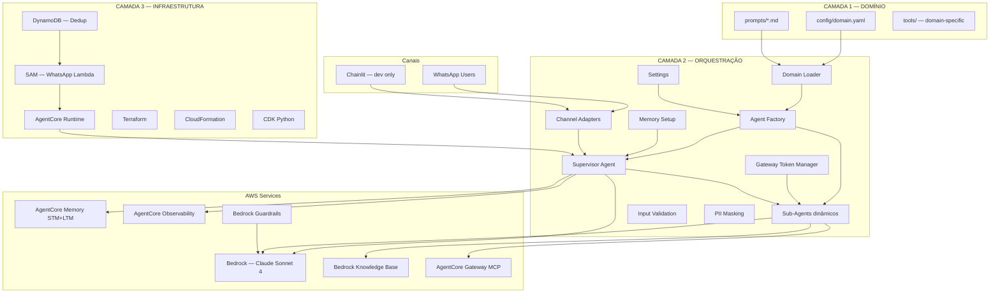
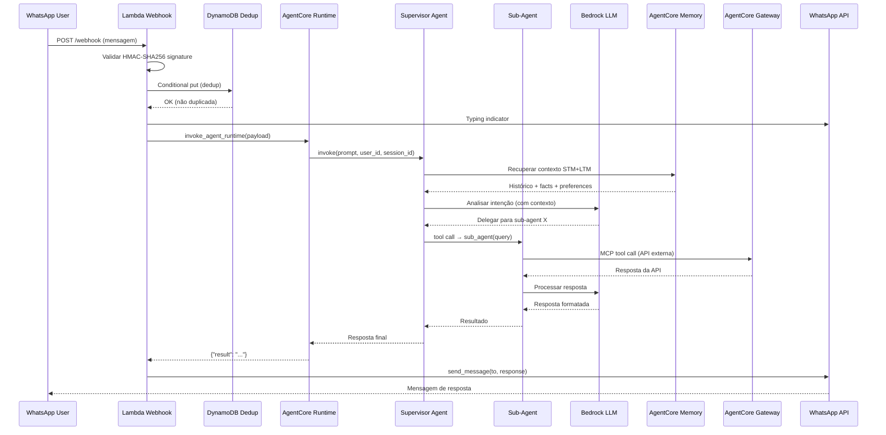

# Design: conversational-agents — Framework Multi-Agente Conversacional Genérico

> **Referência**: [requirements.md](./requirements.md) — 23 User Stories (US-01 a US-23)
> **Projeto de referência**: `paf-conversational-banking/` (73+ pontos de acoplamento ao domínio banking)
> **Objetivo**: Extrair toda lógica domain-specific para `config/domain.yaml` + `prompts/*.md`, mantendo orquestração 100% genérica.

---

## 1. Visão Geral da Arquitetura

### 1.1 Arquitetura em 3 Camadas



### 1.2 Fluxo End-to-End (WhatsApp → Resposta)



### 1.3 Decisão: Agents-as-Tools (não Agent2Agent)

**ADR-001: Padrão de coordenação multi-agente**

| Aspecto | Decisão |
|---------|---------|
| **Contexto** | Precisamos coordenar Supervisor + N sub-agents |
| **Decisão** | Agents-as-Tools (sub-agents registrados como `@tool` no Supervisor) |
| **Alternativa rejeitada** | Agent2Agent (A2A protocol) — complexidade desnecessária |
| **Justificativa** | Strands Agent suporta nativamente; sub-agents são stateless; Supervisor gerencia memória centralmente |
| **Consequência** | Sub-agents não têm `session_manager` próprio; apenas o Supervisor persiste memória |
| **Referência** | [strandsagents.com/agents-as-tools](https://strandsagents.com/latest/documentation/docs/user-guide/concepts/multi-agent/agents-as-tools/) |


---

## 2. Estrutura de Diretórios

```
conversational-agents/
├── config/
│   └── domain.yaml                    # Toda configuração domain-specific
├── prompts/
│   ├── supervisor.md                  # System prompt do Supervisor
│   ├── services.md                    # System prompt do Services Agent
│   └── knowledge.md                   # System prompt do Knowledge Agent
├── src/
│   ├── __init__.py
│   ├── main.py                        # Entrypoint AgentCore Runtime
│   ├── domain/
│   │   ├── __init__.py
│   │   ├── loader.py                  # Carrega e valida domain.yaml
│   │   └── models.py                  # Pydantic models do domain.yaml
│   ├── agents/
│   │   ├── __init__.py
│   │   ├── factory.py                 # Cria agents dinamicamente do YAML
│   │   └── context.py                 # Thread-safe session context (Fix C1)
│   ├── memory/
│   │   ├── __init__.py
│   │   └── setup.py                   # Configura AgentCore Memory genérico
│   ├── gateway/
│   │   ├── __init__.py
│   │   └── token_manager.py           # Singleton com cleanup (Fix C2)
│   ├── channels/
│   │   ├── __init__.py
│   │   ├── base.py                    # ChannelAdapter ABC
│   │   ├── whatsapp/
│   │   │   ├── __init__.py
│   │   │   ├── lambda_handler.py      # Lambda entry point
│   │   │   ├── webhook_processor.py   # Processa webhooks
│   │   │   ├── signature.py           # HMAC-SHA256 validation (Fix C7)
│   │   │   ├── client.py              # WhatsApp Business API client
│   │   │   ├── agentcore_client.py    # Invoca AgentCore Runtime
│   │   │   ├── models.py              # Pydantic models WhatsApp
│   │   │   └── config.py              # Config WhatsApp
│   │   └── chainlit/
│   │       ├── __init__.py
│   │       └── app.py                 # Interface dev/teste
│   ├── config/
│   │   ├── __init__.py
│   │   └── settings.py                # Settings genérico (sem domain-specific)
│   └── utils/
│       ├── __init__.py
│       ├── pii.py                     # PII masking filter (Fix C6)
│       ├── validation.py              # Input validation framework (Fix C5)
│       └── logging.py                 # Structured logging setup
├── tools/                             # Domain-specific tools (registradas via Gateway)
│   └── README.md                      # Instruções para criar tools
├── infrastructure/
│   ├── terraform/
│   │   ├── main.tf
│   │   ├── variables.tf
│   │   └── outputs.tf
│   ├── cloudformation/
│   │   └── template.yaml
│   ├── cdk/
│   │   ├── app.py
│   │   └── stacks/
│   └── whatsapp/
│       ├── template.yaml              # SAM template (Lambda + API GW + DynamoDB)
│       └── deploy.sh
├── scripts/
│   ├── setup.py                       # Gera .bedrock_agentcore.yaml do domain.yaml
│   └── setup_memory.py                # Provisiona AgentCore Memory
├── tests/
│   ├── unit/
│   └── integration/
├── Dockerfile                         # ARM64, genérico
├── pyproject.toml
├── uv.lock
├── .env.example
└── .bedrock_agentcore.yaml            # Gerado por scripts/setup.py
```


---

## 3. Modelo de Dados — Schema do `domain.yaml`

> **US-01, US-04**: Validação Pydantic no startup, fail-fast em campos inválidos.

### 3.1 Pydantic Models (`src/domain/models.py`)

```python
from pathlib import Path
from pydantic import BaseModel, Field, model_validator

class DomainInfo(BaseModel):
    name: str
    slug: str
    description: str
    language_default: str = "pt-BR"

class AgentInfo(BaseModel):
    name: str
    memory_name: str
    session_prefix: str = "session"

class SupervisorConfig(BaseModel):
    prompt_file: str
    description: str
    model_id_env: str  # Nome da env var, ex: "SUPERVISOR_AGENT_MODEL_ID"

class SubAgentConfig(BaseModel):
    name: str
    description: str
    prompt_file: str
    tool_docstring: str
    model_id_env: str

class MemoryNamespaceConfig(BaseModel):
    top_k: int = 5
    relevance_score: float = 0.5

class MemoryConfig(BaseModel):
    namespaces: dict[str, MemoryNamespaceConfig] = {}

class ChannelConfig(BaseModel):
    enabled: bool = True
    type: str  # "webhook" | "local"

class InterfaceConfig(BaseModel):
    welcome_message: str = "Olá! Como posso ajudar?"
    author_name: str = "Assistant"

class ErrorMessagesConfig(BaseModel):
    generic: str = "Desculpe, ocorreu um erro. Tente novamente."
    empty_input: str = "Envie sua pergunta ou solicitação."

class DomainConfig(BaseModel):
    """Schema completo do domain.yaml. Validado no startup."""
    domain: DomainInfo
    agent: AgentInfo
    supervisor: SupervisorConfig
    sub_agents: dict[str, SubAgentConfig] = Field(min_length=1)
    memory: MemoryConfig = MemoryConfig()
    channels: dict[str, ChannelConfig] = {}
    interface: InterfaceConfig = InterfaceConfig()
    error_messages: ErrorMessagesConfig = ErrorMessagesConfig()

    @model_validator(mode="after")
    def validate_prompt_files_exist(self) -> "DomainConfig":
        for path_str in [self.supervisor.prompt_file] + [
            sa.prompt_file for sa in self.sub_agents.values()
        ]:
            if not Path(path_str).exists():
                raise ValueError(f"Prompt file not found: {path_str}")
        return self
```

### 3.2 Exemplo `config/domain.yaml` (Banking)

```yaml
domain:
  name: "BanQi"
  slug: "banqi-banking"
  description: "Assistente bancário conversacional"
  language_default: "pt-BR"

agent:
  name: "banqi_multi_agent"
  memory_name: "BanQiMemory"
  session_prefix: "session"

supervisor:
  prompt_file: "prompts/supervisor.md"
  description: "Coordenador principal"
  model_id_env: "SUPERVISOR_AGENT_MODEL_ID"

sub_agents:
  services:
    name: "Services Agent"
    description: "Operações bancárias"
    prompt_file: "prompts/services.md"
    tool_docstring: "Processa consultas bancárias (saldo, transações, empréstimos)"
    model_id_env: "SERVICES_AGENT_MODEL_ID"
  knowledge:
    name: "Knowledge Agent"
    description: "Informações sobre produtos"
    prompt_file: "prompts/knowledge.md"
    tool_docstring: "Consultas gerais sobre produtos e serviços"
    model_id_env: "GENERAL_AGENT_MODEL_ID"

memory:
  namespaces:
    preferences: { top_k: 3, relevance_score: 0.7 }
    facts: { top_k: 5, relevance_score: 0.5 }
    summaries: { top_k: 3, relevance_score: 0.5 }

channels:
  whatsapp:
    enabled: true
    type: webhook
  chainlit:
    enabled: true
    type: local

interface:
  welcome_message: "Olá! Sou o assistente BanQi. Como posso ajudar?"
  author_name: "BanQi Assistant"

error_messages:
  generic: "Desculpe, ocorreu um erro. Tente novamente."
  empty_input: "Envie sua pergunta ou solicitação."
```


---

## 4. Design dos Componentes

### 4.1 Domain Loader (`src/domain/loader.py`)

> **US-01, US-02, US-04**: Carrega, valida e disponibiliza configuração do domínio.

```python
import os
import yaml
from pathlib import Path
from .models import DomainConfig

_config: DomainConfig | None = None

def load_domain_config(config_path: str = "config/domain.yaml") -> DomainConfig:
    """Carrega e valida domain.yaml. Fail-fast se inválido."""
    global _config
    if _config:
        return _config

    path = Path(config_path)
    if not path.exists():
        raise FileNotFoundError(f"Domain config not found: {config_path}")

    with open(path) as f:
        raw = yaml.safe_load(f)

    # Pydantic valida schema completo — raise ValidationError se inválido
    _config = DomainConfig(**raw)

    # Validar env vars dos modelos (US-04 AC3)
    for agent_key, agent_cfg in _config.sub_agents.items():
        env_var = agent_cfg.model_id_env
        if not os.getenv(env_var):
            raise EnvironmentError(
                f"Environment variable {env_var} required by agent '{agent_cfg.name}' is not set"
            )
    if not os.getenv(_config.supervisor.model_id_env):
        raise EnvironmentError(
            f"Environment variable {_config.supervisor.model_id_env} required by Supervisor is not set"
        )

    return _config

def get_prompt(prompt_file: str) -> str:
    """Carrega prompt de arquivo .md. Fail-fast se não existe (US-02 AC2)."""
    path = Path(prompt_file)
    if not path.exists():
        raise FileNotFoundError(f"Prompt file not found: {prompt_file}")
    return path.read_text(encoding="utf-8")
```

### ADR-PROMPTS: Estratégia de Prompts por Camada

#### Decisão

Todos os prompts (`prompts/*.md`) são **específicos do domínio** e pertencem à Camada 1 (Domínio). Nenhum prompt é genérico — cada implantação escreve os seus.

#### Supervisor: semi-genérico

O prompt do Supervisor tem duas responsabilidades:
1. **Routing** — saber quais sub-agents existem e quando usar cada um
2. **Comportamento** — idioma, pass-through de respostas, memory-awareness

O routing depende do domínio (decision tree, few-shot examples), portanto o prompt é específico. O Agent Factory injeta automaticamente os `tool_docstring` de cada sub-agent como metadata das tools — isso ajuda o Supervisor a rotear, mas o prompt precisa complementar com regras de negócio.

```
prompts/supervisor.md (escrito por domínio):
├── Regras de routing específicas do domínio
├── Decision tree (quando usar qual sub-agent)
├── Few-shot examples do domínio
├── Regras de comportamento (idioma, pass-through)
└── Memory-awareness (como usar contexto do usuário)
```

#### Sub-agents: 100% específicos

Cada sub-agent tem prompt totalmente específico do domínio. O número de sub-agents varia por implantação:

```
Banking:     2 sub-agents (services, knowledge)
Healthcare:  3 sub-agents (appointments, results, knowledge)
E-commerce:  4 sub-agents (orders, catalog, support, knowledge)
Telecom:     3 sub-agents (plans, billing, support)
```

O Agent Factory cria dinamicamente quantos sub-agents o `domain.yaml` definir — o código não se importa com a quantidade.

#### O que é genérico (código, não prompts)

- `src/agents/factory.py` — lê YAML, cria agents, registra tools
- `src/domain/loader.py` — carrega e valida config
- `src/config/settings.py` — env vars e credenciais

#### Estrutura por implantação

```
prompts/                    ← TUDO específico do domínio (Camada 1)
├── supervisor.md           ← Routing rules + decision tree + few-shots
├── services.md             ← Prompt do sub-agent 1
├── knowledge.md            ← Prompt do sub-agent 2
└── (N prompts para N sub-agents)
```

### 4.2 Agent Factory (`src/agents/factory.py`)

> **US-05, US-06**: Cria Supervisor + sub-agents dinamicamente do YAML. Thread-safe.

```python
import os
import threading
from strands import Agent, tool
from strands.models import BedrockModel
from strands.types.content import SystemContentBlock
from strands.agent.conversation_manager import SlidingWindowConversationManager

from src.domain.loader import load_domain_config, get_prompt
from src.agents.context import SessionContext
from src.config.settings import settings

# Thread-local context (Fix C1 — substitui dict global mutável)
_session_ctx = SessionContext()


def _create_sub_agent(key: str, user_id: str | None, session_id: str | None) -> Agent:
    """Cria um sub-agent a partir da config YAML."""
    cfg = load_domain_config()
    agent_cfg = cfg.sub_agents[key]

    model = BedrockModel(
        model_id=os.environ[agent_cfg.model_id_env],
        cache_tools="default",
        **_guardrail_kwargs(),
    )

    prompt_text = get_prompt(agent_cfg.prompt_file)
    system_prompt = [
        SystemContentBlock(text=prompt_text),
        SystemContentBlock(cachePoint={"type": "default"}),
    ]

    return Agent(
        name=agent_cfg.name,
        model=model,
        tools=_load_agent_tools(key),
        system_prompt=system_prompt,
        agent_id=f"{key}_agent",
        description=agent_cfg.description,
    )


def _make_delegate_tool(key: str, docstring: str):
    """Cria uma @tool function que delega para um sub-agent."""
    @tool
    def delegate(query: str) -> str:
        ctx = _session_ctx.get()
        agent = _create_sub_agent(key, ctx.user_id, ctx.session_id)
        return str(agent(query))

    delegate.__name__ = f"{key}_assistant"
    delegate.__doc__ = docstring
    # Strands usa __name__ para registrar a tool
    delegate.tool_name = f"{key}_assistant"
    return delegate


def create_supervisor(user_id: str | None = None, session_id: str | None = None) -> Agent:
    """Cria Supervisor Agent com sub-agents como tools."""
    cfg = load_domain_config()

    # Atualiza contexto thread-local (Fix C1)
    _session_ctx.set(user_id=user_id, session_id=session_id)

    model = BedrockModel(
        model_id=os.environ[cfg.supervisor.model_id_env],
        cache_tools="default",
        **_guardrail_kwargs(),
    )

    prompt_text = get_prompt(cfg.supervisor.prompt_file)
    system_prompt = [
        SystemContentBlock(text=prompt_text),
        SystemContentBlock(cachePoint={"type": "default"}),
    ]

    # Registra cada sub-agent como tool (Agents-as-Tools pattern)
    delegate_tools = [
        _make_delegate_tool(key, sa.tool_docstring)
        for key, sa in cfg.sub_agents.items()
    ]

    supervisor = Agent(
        name="Supervisor Agent",
        model=model,
        tools=delegate_tools,
        system_prompt=system_prompt,
        agent_id="supervisor_agent",
        description=cfg.supervisor.description,
        conversation_manager=SlidingWindowConversationManager(
            window_size=settings.CONVERSATION_WINDOW_SIZE,
            should_truncate_results=True,
        ),
    )

    # Configura memória se user_id fornecido
    if user_id:
        from src.memory.setup import attach_memory(supervisor, cfg, user_id, session_id)

    return supervisor


def _guardrail_kwargs() -> dict:
    """Retorna kwargs de guardrail se configurado."""
    gid = os.getenv("BEDROCK_GUARDRAIL_ID")
    if not gid:
        return {}
    return {
        "guardrail_id": gid,
        "guardrail_version": os.getenv("BEDROCK_GUARDRAIL_VERSION", "DRAFT"),
        "guardrail_trace": "enabled",
        "guardrail_redact_input": True,
        "guardrail_redact_output": False,
    }


def _load_agent_tools(key: str) -> list:
    """Carrega tools específicas do agente via Gateway MCP ou built-in."""
    # Tools são carregadas via AgentCore Gateway (MCP) em runtime
    # O framework não hardcoda tools — elas vêm do Gateway config
    return []
```


### 4.3 Thread-Safe Session Context (`src/agents/context.py`) — Fix C1

> **US-06**: Substitui `_supervisor_context` (dict global mutável) por `threading.local()`.

```python
import threading
from dataclasses import dataclass

@dataclass
class _Ctx:
    user_id: str | None = None
    session_id: str | None = None

class SessionContext:
    """Thread-local session context. Cada request tem seu próprio user_id/session_id."""

    def __init__(self):
        self._local = threading.local()

    def set(self, user_id: str | None, session_id: str | None) -> None:
        self._local.ctx = _Ctx(user_id=user_id, session_id=session_id)

    def get(self) -> _Ctx:
        return getattr(self._local, "ctx", _Ctx())
```

### 4.4 Memory Setup Genérico (`src/memory/setup.py`)

> **US-08**: Configura AgentCore Memory (STM+LTM) a partir dos namespaces do `domain.yaml`.

```python
import os
import logging
from datetime import datetime

from bedrock_agentcore.memory.integrations.strands.config import (
    AgentCoreMemoryConfig, RetrievalConfig,
)
from bedrock_agentcore.memory.integrations.strands.session_manager import (
    AgentCoreMemorySessionManager,
)
from strands_tools.agent_core_memory import AgentCoreMemoryToolProvider

from src.domain.models import DomainConfig

logger = logging.getLogger(__name__)


def attach_memory(agent, cfg: DomainConfig, user_id: str, session_id: str | None = None):
    """Anexa AgentCore Memory ao agent usando namespaces do domain.yaml."""
    memory_id = os.environ.get("AGENTCORE_MEMORY_ID")
    if not memory_id:
        raise EnvironmentError("AGENTCORE_MEMORY_ID is required but not set")

    if not session_id:
        prefix = cfg.agent.session_prefix
        session_id = f"{prefix}_{datetime.now().strftime('%Y%m%d_%H%M%S')}"

    region = os.environ.get("AWS_REGION", "us-east-1")

    # Monta retrieval_config a partir dos namespaces do YAML
    retrieval_config = {}
    for ns_name, ns_cfg in cfg.memory.namespaces.items():
        namespace_path = f"/{ns_name}/{user_id}"
        if ns_name == "summaries":
            namespace_path = f"/{ns_name}/{user_id}/{session_id}"
        retrieval_config[namespace_path] = RetrievalConfig(
            top_k=ns_cfg.top_k,
            relevance_score=ns_cfg.relevance_score,
        )

    memory_config = AgentCoreMemoryConfig(
        memory_id=memory_id,
        session_id=session_id,
        actor_id=user_id,
        retrieval_config=retrieval_config,
    )

    agent.session_manager = AgentCoreMemorySessionManager(
        agentcore_memory_config=memory_config,
        region_name=region,
    )

    # LTM tools para gerenciamento ativo de memória
    ltm_provider = AgentCoreMemoryToolProvider(
        memory_id=memory_id,
        actor_id=user_id,
        session_id=session_id,
        region=region,
        namespace=f"/users/{user_id}",
    )
    if hasattr(agent, "tools") and agent.tools:
        agent.tools.extend(ltm_provider.tools)
    else:
        agent.tools = ltm_provider.tools

    logger.info(f"Memory attached — memory_id={memory_id}, actor={user_id}")
```

### 4.5 Gateway Token Manager — Singleton com Cleanup (`src/gateway/token_manager.py`) — Fix C2

> **US-07**: MCP Client como singleton com lifecycle management.

```python
import asyncio
import logging
from datetime import datetime, timedelta
import httpx

logger = logging.getLogger(__name__)


class GatewayTokenManager:
    """Singleton para gerenciar tokens OAuth do AgentCore Gateway.
    
    Fix C2: garante cleanup do HTTP client.
    Fix C3: fail-fast se token não pode ser obtido (sem fallback silencioso).
    """

    _instance: "GatewayTokenManager | None" = None

    def __init__(self, client_id: str, client_secret: str, token_endpoint: str, scope: str):
        self._client_id = client_id
        self._client_secret = client_secret
        self._token_endpoint = token_endpoint
        self._scope = scope
        self._token: str | None = None
        self._expires_at: datetime | None = None
        self._http_client: httpx.AsyncClient | None = None

    @classmethod
    def get_instance(cls, **kwargs) -> "GatewayTokenManager":
        if cls._instance is None:
            cls._instance = cls(**kwargs)
        return cls._instance

    async def get_token(self) -> str:
        """Obtém token válido. Fail-fast se falhar (Fix C3)."""
        if self._token and self._expires_at and self._expires_at > datetime.now():
            return self._token

        if self._http_client is None:
            self._http_client = httpx.AsyncClient(timeout=30.0)

        response = await self._http_client.post(
            self._token_endpoint,
            data={
                "grant_type": "client_credentials",
                "client_id": self._client_id,
                "client_secret": self._client_secret,
                "scope": self._scope,
            },
            headers={"Content-Type": "application/x-www-form-urlencoded"},
        )
        response.raise_for_status()  # Fail-fast — sem fallback_token
        data = response.json()

        self._token = data["access_token"]
        expires_in = data.get("expires_in", 3600) - 300  # Buffer 5min
        self._expires_at = datetime.now() + timedelta(seconds=expires_in)
        return self._token

    async def cleanup(self) -> None:
        """Fecha HTTP client. Chamado no shutdown da aplicação."""
        if self._http_client:
            await self._http_client.aclose()
            self._http_client = None
        self._token = None
        self._expires_at = None
        GatewayTokenManager._instance = None
        logger.info("GatewayTokenManager cleaned up")
```


### 4.6 Channel Adapter Pattern (`src/channels/base.py`)

> **US-10, US-23**: Interface abstrata para canais. Novos canais implementam apenas esta ABC.

```python
from abc import ABC, abstractmethod
from dataclasses import dataclass

@dataclass
class IncomingMessage:
    """Mensagem normalizada de qualquer canal."""
    text: str
    user_id: str
    channel: str
    raw_metadata: dict  # Dados específicos do canal

@dataclass
class OutgoingResponse:
    """Resposta normalizada para qualquer canal."""
    text: str
    user_id: str

class ChannelAdapter(ABC):
    """Interface abstrata que todos os canais implementam."""

    @abstractmethod
    async def receive_message(self, raw_event: dict) -> IncomingMessage | None:
        """Extrai mensagem normalizada do evento raw do canal."""
        ...

    @abstractmethod
    async def send_response(self, response: OutgoingResponse) -> bool:
        """Envia resposta formatada de volta ao canal."""
        ...

    async def verify_webhook(self, params: dict) -> str | None:
        """Verificação de webhook (opcional — canais webhook-based)."""
        return None

    async def send_typing_indicator(self, user_id: str) -> None:
        """Indicador de digitação (opcional)."""
        pass
```

**WhatsApp Adapter** (`src/channels/whatsapp/`) implementa:
- `receive_message()` → parse do webhook Meta
- `send_response()` → WhatsApp Business API
- `verify_webhook()` → GET challenge/response
- `send_typing_indicator()` → marca como lida + typing
- `signature.py` → HMAC-SHA256 validation (Fix C7)

**Chainlit Adapter** (`src/channels/chainlit/app.py`) implementa:
- `receive_message()` → `@cl.on_message`
- `send_response()` → `cl.Message().send()`

### 4.7 Settings Genérico (`src/config/settings.py`)

> **US-09**: Fail-fast em credenciais ausentes. Zero campos domain-specific.

```python
import os
from typing import Optional
from pydantic import Field
from pydantic_settings import BaseSettings, SettingsConfigDict


class Settings(BaseSettings):
    """Settings genérico — sem campos domain-specific (banking, BanQi, etc.)."""

    # AWS
    AWS_REGION: str = "us-east-1"

    # AgentCore
    AGENTCORE_MEMORY_ID: str  # Obrigatório — fail-fast se ausente

    # Bedrock Guardrails (opcional)
    BEDROCK_GUARDRAIL_ID: Optional[str] = None
    BEDROCK_GUARDRAIL_VERSION: str = "DRAFT"

    # Bedrock Knowledge Base
    BEDROCK_KB_ID: Optional[str] = None
    MIN_SCORE: float = 0.4

    # Conversation
    CONVERSATION_WINDOW_SIZE: int = 10

    # Observability
    OPENTELEMETRY_ENABLED: bool = True

    model_config = SettingsConfigDict(
        env_file=".env",
        env_file_encoding="utf-8",
        extra="allow",  # Permite env vars domain-specific sem quebrar
    )

settings = Settings()
```

**Nota**: Model IDs (`SUPERVISOR_AGENT_MODEL_ID`, etc.) são lidos via `os.environ[]` diretamente pelo Agent Factory, referenciados pelo nome da env var no `domain.yaml`. O Settings não precisa conhecê-los.

### 4.8 Input Validation Framework (`src/utils/validation.py`) — Fix C5

> **US-17**: Validação genérica de inputs com Pydantic. Extensível por domínio.

```python
import re
from pydantic import BaseModel, field_validator

# Validadores reutilizáveis para campos comuns
_CPF_PATTERN = re.compile(r"^\d{11}$")
_PHONE_PATTERN = re.compile(r"^\d{10,15}$")


class CPFInput(BaseModel):
    """Validador para campos CPF."""
    cpf: str

    @field_validator("cpf")
    @classmethod
    def validate_cpf(cls, v: str) -> str:
        clean = re.sub(r"[.\-/]", "", v.strip())
        if not _CPF_PATTERN.match(clean):
            raise ValueError("CPF deve conter exatamente 11 dígitos numéricos")
        return clean


class PhoneInput(BaseModel):
    """Validador para campos de telefone."""
    phone: str

    @field_validator("phone")
    @classmethod
    def validate_phone(cls, v: str) -> str:
        clean = re.sub(r"[+\-\s()]", "", v.strip())
        if not _PHONE_PATTERN.match(clean):
            raise ValueError("Telefone deve conter 10-15 dígitos")
        return clean


def validate_non_empty(value: str, field_name: str = "input") -> str:
    """Valida que input não é vazio."""
    if not value or not value.strip():
        raise ValueError(f"{field_name} não pode ser vazio")
    return value.strip()
```


### 4.9 PII Masking (`src/utils/pii.py`) — Fix C6

> **US-18**: Filtro de logging que mascara CPF, telefone e nomes antes de escrever no CloudWatch.

```python
import logging
### 4.9 Estratégia Dual de Proteção de PII

> **US-18, US-34**: Proteção de PII em duas camadas complementares — LGPD compliance.

#### Arquitetura

```
┌─────────────────────────────────────────────────────────┐
│  Camada 1: Bedrock Guardrails (conversa LLM)            │
│  • Sensitive information filter (30+ tipos de PII)      │
│  • Atua na entrada E saída do modelo                    │
│  • Configurável por domínio via domain.yaml             │
│  • Custo: ~$0.75/1K text units                          │
│  • NÃO protege logs                                     │
└─────────────────────────────────────────────────────────┘
┌─────────────────────────────────────────────────────────┐
│  Camada 2: utils/pii.py (logs CloudWatch)               │
│  • Regex leve para CPF/telefone/email                   │
│  • Zero latência, zero custo                            │
│  • Safety net universal nos logs                        │
│  • NÃO protege a conversa do usuário                    │
└─────────────────────────────────────────────────────────┘
```

#### Por que as duas camadas

| Cenário | Guardrails | utils/pii.py |
|---------|-----------|-------------|
| Usuário envia CPF no chat | ✅ Redact na entrada | ❌ Não atua |
| LLM gera PII na resposta | ✅ Redact na saída | ❌ Não atua |
| Código faz `logger.info(f"CPF: {cpf}")` | ❌ Não atua | ✅ Mascara no log |
| PII em traces/métricas | ❌ Não atua | ✅ Mascara no log |

#### Configuração no domain.yaml

```yaml
guardrails:
  id_env: "BEDROCK_GUARDRAIL_ID"
  version: "DRAFT"
  # Tipos de PII variam por domínio — configurar no Bedrock Console
  # Banking: CPF, CREDIT_CARD, PHONE, EMAIL
  # Healthcare: PHONE, EMAIL, ADDRESS, NAME
  # Retail: CREDIT_CARD, ADDRESS, PHONE, EMAIL
```

#### ADR-PII: Estratégia dual Guardrails + regex

- **Decisão**: Usar Bedrock Guardrails para PII na conversa + regex local para PII nos logs
- **Motivo**: Guardrails não cobre logs; regex não cobre conversa LLM. São complementares.
- **Trade-off**: Custo adicional do Guardrails (~$0.75/1K units) vs proteção completa multi-domínio
- **Alternativa rejeitada**: Só regex — não escala para 30+ tipos de PII em múltiplos domínios

#### Implementação: utils/pii.py (Camada 2 — logs)

```python
import logging
import re

# Patterns para detecção de PII
_PATTERNS = [
    # CPF: 123.456.789-00 ou 12345678900
    (re.compile(r"\b(\d{3})[.\s]?(\d{3})[.\s]?(\d{3})[-.\s]?(\d{2})\b"), r"***.***.***-\4"),
    # Telefone: +55 11 99999-9999 ou variações
    (re.compile(r"\+?\d{1,3}[\s-]?\(?\d{2}\)?[\s-]?\d{4,5}[-.\s]?\d{4}"), "***-****-****"),
    # Telefone simples: 11999999999
    (re.compile(r"\b\d{10,13}\b"), "**********"),
]


class PIIMaskingFilter(logging.Filter):
    """Filtro de logging que mascara PII em todas as mensagens."""

    def filter(self, record: logging.LogRecord) -> bool:
        if isinstance(record.msg, str):
            record.msg = mask_pii(record.msg)
        if record.args:
            record.args = tuple(
                mask_pii(str(a)) if isinstance(a, str) else a
                for a in (record.args if isinstance(record.args, tuple) else (record.args,))
            )
        return True


def mask_pii(text: str) -> str:
    """Mascara PII em uma string."""
    for pattern, replacement in _PATTERNS:
        text = pattern.sub(replacement, text)
    return text


def setup_pii_logging():
    """Aplica PIIMaskingFilter a todos os loggers."""
    pii_filter = PIIMaskingFilter()
    for handler in logging.root.handlers:
        handler.addFilter(pii_filter)
    # Também aplica ao root logger para novos handlers
    logging.root.addFilter(pii_filter)
```

### 4.10 WhatsApp Signature Validation (`src/channels/whatsapp/signature.py`) — Fix C7

> **US-12**: Validação real HMAC-SHA256 do webhook. Nunca retorna `True` incondicionalmente.

```python
import hashlib
import hmac
import logging

logger = logging.getLogger(__name__)


def validate_webhook_signature(payload_body: bytes, signature_header: str | None, app_secret: str) -> bool:
    """Valida X-Hub-Signature-256 do webhook Meta.
    
    Retorna False (rejeita) se:
    - signature_header ausente
    - app_secret não configurado
    - HMAC não confere
    """
    if not signature_header:
        logger.warning("Webhook rejected: missing X-Hub-Signature-256 header")
        return False

    if not app_secret:
        logger.error("Webhook rejected: WHATSAPP_APP_SECRET not configured")
        return False

    # Header format: "sha256=<hex_digest>"
    if not signature_header.startswith("sha256="):
        logger.warning("Webhook rejected: invalid signature format")
        return False

    expected_sig = signature_header[7:]  # Remove "sha256=" prefix
    computed_sig = hmac.new(
        app_secret.encode("utf-8"),
        payload_body,
        hashlib.sha256,
    ).hexdigest()

    if not hmac.compare_digest(computed_sig, expected_sig):
        logger.warning("Webhook rejected: HMAC signature mismatch")
        return False

    return True
```


### 4.11 Entrypoint AgentCore Runtime (`src/main.py`)

> **US-14**: Entrypoint genérico. Nenhuma referência a domínio específico.

```python
import logging
import os
import sys

sys.path.insert(0, os.path.dirname(os.path.abspath(__file__)))

from bedrock_agentcore.runtime import BedrockAgentCoreApp
from src.domain.loader import load_domain_config
from src.agents.factory import create_supervisor
from src.config.settings import settings
from src.utils.pii import setup_pii_logging
from src.utils.validation import validate_non_empty

# PII masking em todos os logs (Fix C6)
setup_pii_logging()

logger = logging.getLogger(__name__)

# Carrega e valida domain.yaml no startup (fail-fast)
cfg = load_domain_config()

# Configura env vars para tools built-in
if settings.BEDROCK_KB_ID:
    os.environ.setdefault("KNOWLEDGE_BASE_ID", settings.BEDROCK_KB_ID)

app = BedrockAgentCoreApp()

@app.ping
def health():
    return "Healthy"

@app.entrypoint
def invoke(payload: dict):
    try:
        user_message = payload.get("prompt", "") or payload.get("input", {}).get("prompt", "")
        user_message = validate_non_empty(user_message, "prompt")
    except ValueError:
        return {"result": cfg.error_messages.empty_input}

    phone = payload.get("phone_number") or payload.get("from") or payload.get("wa_id")
    user_id = phone or payload.get("user_id", "default_user")
    session_id = payload.get("session_id") or f"{cfg.agent.session_prefix}-{user_id}"

    try:
        supervisor = create_supervisor(user_id=user_id, session_id=session_id)
        result = supervisor(user_message)

        # Extrair texto da resposta
        if hasattr(result, "message") and isinstance(result.message, dict):
            content = result.message.get("content", [])
            text = content[0].get("text", str(result)) if content else str(result)
        else:
            text = str(result)

        return {"result": text}

    except Exception as e:
        logger.error(f"Processing error: {type(e).__name__}: {e}", exc_info=True)
        return {"result": cfg.error_messages.generic}

if __name__ == "__main__":
    logger.info(f"Starting {cfg.domain.name} multi-agent system on port 8080...")
    app.run()
```


---

## 5. Decisões Técnicas (ADRs)

### ADR-001: Agents-as-Tools (não Agent2Agent)
> Coberto na seção 1.3.

### ADR-002: `threading.local()` para session context

| Aspecto | Decisão |
|---------|---------|
| **Contexto** | O projeto original usa `_supervisor_context = {}` (dict global mutável) para compartilhar `user_id`/`session_id` entre Supervisor e sub-agent tools. Isso causa race conditions em requests concorrentes (C1). |
| **Decisão** | Usar `threading.local()` encapsulado em `SessionContext` |
| **Alternativa rejeitada** | `contextvars.ContextVar` — mais moderno, mas `threading.local()` é suficiente e mais simples para o modelo sync do AgentCore Runtime |
| **Consequência** | Cada thread/request tem seu próprio contexto isolado |

### ADR-003: Singleton com cleanup para MCP/Gateway client

| Aspecto | Decisão |
|---------|---------|
| **Contexto** | O projeto original chama `MCPClient.__enter__()` sem `__exit__()`, causando resource leak (C2). Token fallback silencioso para `"fallback_token"` (C3). |
| **Decisão** | `GatewayTokenManager` como singleton com `cleanup()` explícito no shutdown |
| **Consequência** | Requer chamada a `cleanup()` no shutdown; `get_token()` faz fail-fast sem fallback |

### ADR-004: Domain config em YAML (não Python)

| Aspecto | Decisão |
|---------|---------|
| **Contexto** | Precisamos separar configuração domain-specific do código de orquestração |
| **Decisão** | `config/domain.yaml` validado por Pydantic no startup |
| **Alternativa rejeitada** | TOML (menos expressivo para nested structures), JSON (sem comentários), Python dict (mistura config com código) |
| **Consequência** | Prompt engineers e POs podem editar YAML sem tocar em Python |

### ADR-005: WhatsApp como Lambda separada (não dentro do AgentCore container)

| Aspecto | Decisão |
|---------|---------|
| **Contexto** | WhatsApp webhook precisa responder em < 5s (timeout Meta). AgentCore Runtime processa em 2-10s. |
| **Decisão** | Lambda (SAM) recebe webhook → invoca AgentCore Runtime via `invoke_agent_runtime` → responde async |
| **Alternativa rejeitada** | Webhook direto no container AgentCore — não suporta o padrão async necessário |
| **Consequência** | Dois deploys: SAM (Lambda) + AgentCore (container). DynamoDB para dedup. |

### ADR-006: Infraestrutura agnóstica (3 formatos)

| Aspecto | Decisão |
|---------|---------|
| **Contexto** | Diferentes organizações usam diferentes ferramentas de IaC |
| **Decisão** | Fornecer templates em Terraform, CloudFormation e CDK Python |
| **Consequência** | Mais manutenção (3 templates), mas maior adoção. Templates são parametrizados — nomes vêm de variáveis. |

### ADR-007: Chainlit apenas dev/teste

| Aspecto | Decisão |
|---------|---------|
| **Contexto** | Chainlit é útil para iteração rápida mas não é canal de produção |
| **Decisão** | Chainlit adapter disponível apenas quando `channels.chainlit.enabled: true` no YAML. Não vai para produção. |
| **Consequência** | Chainlit é dependência opcional (`[dev]` no pyproject.toml) |

---

## 6. Estratégia de Infraestrutura Agnóstica

### 6.1 Recursos Provisionados

Todos os 3 formatos (Terraform/CFN/CDK) provisionam os mesmos recursos:

| Recurso | Propósito |
|---------|-----------|
| AgentCore Runtime | Container ARM64 com os agentes |
| Lambda Function | WhatsApp webhook processor |
| API Gateway | Endpoint público para webhook |
| DynamoDB Table | Deduplicação de mensagens (TTL) |
| IAM Roles | Least-privilege (Fix C4) |
| ECR Repository | Imagens Docker |

### 6.2 Parametrização

Todos os templates usam variáveis para nomes de recursos:

```hcl
# Terraform example
variable "domain_slug"    { description = "Slug do domínio (ex: banqi-banking)" }
variable "agent_name"     { description = "Nome do agente AgentCore" }
variable "environment"    { default = "dev" }
variable "aws_region"     { default = "us-east-1" }
variable "aws_account_id" { description = "AWS Account ID para ARNs" }
```

### 6.3 IAM Least-Privilege (Fix C4)

```json
{
  "Effect": "Allow",
  "Action": [
    "bedrock-agentcore:InvokeAgentRuntime",
    "bedrock-agentcore:GetMemory",
    "bedrock-agentcore:PutMemory",
    "bedrock-agentcore:CreateEvent"
  ],
  "Resource": [
    "arn:aws:bedrock-agentcore:${Region}:${AccountId}:runtime/${AgentName}*",
    "arn:aws:bedrock-agentcore:${Region}:${AccountId}:memory/${MemoryName}*"
  ]
}
```

**Nunca** `Resource: '*'` — todos os ARNs são scoped com account, region e resource name.

### 6.4 Dockerfile Genérico

```dockerfile
FROM --platform=linux/arm64 ghcr.io/astral-sh/uv:python3.12-bookworm-slim
WORKDIR /app

ENV UV_SYSTEM_PYTHON=1 \
    UV_COMPILE_BYTECODE=1 \
    PYTHONUNBUFFERED=1

COPY pyproject.toml uv.lock ./
RUN uv sync --frozen --no-cache

COPY . .

RUN uv pip install aws-opentelemetry-distro>=0.10.1

RUN useradd -m -u 1000 bedrock_agentcore
USER bedrock_agentcore

EXPOSE 8080

CMD ["opentelemetry-instrument", "python", "-m", "src.main"]
```

**Nota**: Zero referências a domínio específico. Env vars são injetadas no deploy.

### 6.5 `.bedrock_agentcore.yaml` (Gerado)

Gerado por `scripts/setup.py` a partir do `domain.yaml`:

```yaml
default_agent: ${agent.name}
agents:
  ${agent.name}:
    name: ${agent.name}
    entrypoint: src/main.py
    platform: linux/arm64
    container_runtime: docker
    aws:
      region: ${AWS_REGION}
      network_configuration:
        network_mode: PUBLIC
      protocol_configuration:
        server_protocol: HTTP
      observability:
        enabled: true
    memory:
      mode: STM_AND_LTM
      memory_name: ${agent.memory_name}
```


---

## 7. Error Handling Strategy

### 7.1 Camadas de Tratamento

```
┌─────────────────────────────────────────────┐
│  Canal (Lambda/Chainlit)                    │
│  → Captura exceções, retorna error_messages │
│    do domain.yaml ao usuário                │
├─────────────────────────────────────────────┤
│  AgentCore Entrypoint (main.py)             │
│  → Captura exceções do Supervisor           │
│  → Retorna error_messages.generic           │
├─────────────────────────────────────────────┤
│  Agent Factory                              │
│  → Fail-fast no startup (config, env vars)  │
│  → Tool errors logados, mensagem amigável   │
├─────────────────────────────────────────────┤
│  Tools (domain-specific)                    │
│  → Pydantic validation nos inputs           │
│  → Exceções propagam para o Agent loop      │
└─────────────────────────────────────────────┘
```

### 7.2 Fail-Fast no Startup (US-09)

O sistema falha **antes de aceitar requests** se:
- `config/domain.yaml` ausente ou inválido
- Prompt files referenciados não existem
- Env vars de model IDs não estão definidas
- `AGENTCORE_MEMORY_ID` não está definida

### 7.3 Erros em Runtime

| Cenário | Comportamento |
|---------|---------------|
| Tool falha | Agent loop recebe erro, tenta alternativa ou retorna mensagem amigável |
| LLM timeout | Exceção propagada, entrypoint retorna `error_messages.generic` |
| Memory indisponível | Log warning, agent funciona sem memória (degraded) |
| Webhook duplicado | DynamoDB dedup, retorna early com `{"status": "duplicate"}` |
| Signature inválida | HTTP 403, log do attempt |

---

## 8. Observabilidade

> **US-21, US-22**: Structured logging + AgentCore Observability.

### 8.1 Logging Estruturado (`src/utils/logging.py`)

```python
import logging
import json
from src.utils.pii import setup_pii_logging

class JSONFormatter(logging.Formatter):
    def format(self, record):
        log_entry = {
            "timestamp": self.formatTime(record),
            "level": record.levelname,
            "logger": record.name,
            "message": record.getMessage(),
        }
        # Campos opcionais do contexto
        for field in ("agent_name", "session_id", "request_id", "duration_ms"):
            if hasattr(record, field):
                log_entry[field] = getattr(record, field)
        if record.exc_info:
            log_entry["exception"] = self.formatException(record.exc_info)
        return json.dumps(log_entry, ensure_ascii=False)

def setup_logging():
    handler = logging.StreamHandler()
    handler.setFormatter(JSONFormatter())
    logging.root.handlers = [handler]
    logging.root.setLevel(logging.INFO)
    # Reduz verbosidade de libs externas
    for lib in ("httpx", "urllib3", "boto3", "botocore"):
        logging.getLogger(lib).setLevel(logging.WARNING)
    # PII masking em todos os handlers
    setup_pii_logging()
```

### 8.2 AgentCore Observability

Habilitado via `.bedrock_agentcore.yaml` (`observability.enabled: true`) + OpenTelemetry distro no Dockerfile. Traces distribuídos cobrem:
- Supervisor → sub-agent delegation
- Tool invocations (nome, duração, sucesso/falha)
- Memory operations (STM read/write, LTM retrieval)
- Gateway/MCP calls

---

## 9. Rastreabilidade: Requirements → Design

| User Story | Componente de Design | Seção |
|------------|---------------------|-------|
| US-01 | Domain Loader + DomainConfig | 3.1, 4.1 |
| US-02 | `get_prompt()` + prompt caching | 4.1 |
| US-03 | `InterfaceConfig` + `ErrorMessagesConfig` | 3.1 |
| US-04 | `DomainConfig` Pydantic validation | 3.1 |
| US-05 | Agent Factory + `create_supervisor()` | 4.2 |
| US-06 | `SessionContext` (threading.local) | 4.3 |
| US-07 | `GatewayTokenManager` singleton | 4.5 |
| US-08 | `attach_memory()` genérico | 4.4 |
| US-09 | Settings fail-fast + `validate_non_empty()` | 4.7 |
| US-10 | `ChannelAdapter` ABC | 4.6 |
| US-11 | WhatsApp adapter (channels/whatsapp/) | 4.6 |
| US-12 | `validate_webhook_signature()` | 4.10 |
| US-13 | Chainlit adapter (channels/chainlit/) | 4.6 |
| US-14 | `main.py` entrypoint + Dockerfile | 4.11, 6.4 |
| US-15 | Terraform/CFN/CDK templates | 6.1 |
| US-16 | IAM least-privilege | 6.3 |
| US-17 | `CPFInput`, `PhoneInput` validators | 4.8 |
| US-18 | `PIIMaskingFilter` | 4.9 |
| US-19 | `_guardrail_kwargs()` no Agent Factory | 4.2 |
| US-20 | Prompt caching + SlidingWindow | 4.2 |
| US-21 | `JSONFormatter` + AgentCore Observability | 8.1, 8.2 |
| US-22 | `/ping` health check | 4.11 |
| US-23 | `ChannelAdapter` ABC extensível | 4.6 |

### Critical Issues → Componentes

| Issue | Fix | Componente |
|-------|-----|-----------|
| C1 | `threading.local()` | `src/agents/context.py` (4.3) |
| C2 | Singleton + `cleanup()` | `src/gateway/token_manager.py` (4.5) |
| C3 | `raise` em vez de fallback | `GatewayTokenManager.get_token()` (4.5) |
| C4 | ARNs scoped | `infrastructure/*/` (6.3) |
| C5 | Pydantic validators | `src/utils/validation.py` (4.8) |
| C6 | `PIIMaskingFilter` | `src/utils/pii.py` (4.9) |
| C7 | HMAC-SHA256 real | `src/channels/whatsapp/signature.py` (4.10) |

---

## 10. Faseamento de Implementação

Alinhado com o faseamento do requirements.md:

### Fase 1: Core Framework (MVP)
- Domain Loader + Pydantic models (US-01, US-02, US-03, US-04)
- Agent Factory + SessionContext (US-05, US-06)
- Gateway Token Manager (US-07)
- Memory Setup (US-08)
- Settings fail-fast (US-09)
- Input Validation + PII Masking (US-17, US-18)
- Structured Logging (US-21, US-22)

### Fase 2: Canais
- ChannelAdapter ABC (US-10)
- WhatsApp adapter + signature validation (US-11, US-12)
- Chainlit adapter (US-13)

### Fase 3: Infraestrutura
- Dockerfile + main.py entrypoint (US-14)
- Terraform/CFN/CDK templates (US-15)
- IAM least-privilege (US-16)

### Fase 4: Polish
- Bedrock Guardrails (US-19)
- Performance tuning — prompt caching (US-20)
- Extensibilidade validada (US-23)
