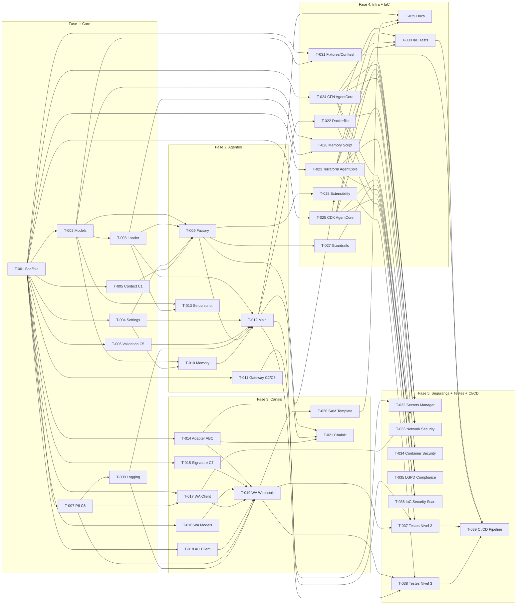

# Tasks: conversational-agents — Framework Multi-Agente Conversacional Genérico

> **Referências**: [requirements.md](./requirements.md) (US-01 a US-23) · [design.md](./design.md) (10 seções)
> **Projeto**: `conversational-agents/` — framework genérico baseado em Strands Agent + AWS AgentCore Runtime
> **Estratégia**: 4 fases incrementais, cada uma mergeable independentemente

---

## Convenções

- **Esforço**: S (< 2h) · M (2–6h) · L (6–16h)
- **Dependências**: `—` = nenhuma · `T-XXX` = task que deve estar pronta antes
- **US-XX** = User Story do requirements.md · **C-X** = Critical Issue do relatório
- **§X.Y** = Seção do design.md

---

## Fase 1: Estrutura Base + Domain Loader + Settings + Critical Fixes

> **Objetivo**: Projeto inicializa, carrega `domain.yaml`, valida config, e resolve issues críticos de segurança/estabilidade.
> **User Stories**: US-01, US-02, US-03, US-04, US-06, US-07, US-09, US-17, US-18, US-21, US-22
> **Critical Issues**: C1, C2, C3, C5, C6

---

### T-001: Scaffold do projeto e dependências [S]

- **Objetivo**: Criar estrutura de diretórios, `pyproject.toml` com todas as dependências, `.env.example`, e arquivos `__init__.py`.
- **Arquivos a criar**:
  - `pyproject.toml`
  - `.env.example`
  - `config/` (diretório vazio com `.gitkeep`)
  - `prompts/` (diretório vazio com `.gitkeep`)
  - `src/__init__.py`
  - `src/domain/__init__.py`
  - `src/agents/__init__.py`
  - `src/memory/__init__.py`
  - `src/gateway/__init__.py`
  - `src/channels/__init__.py`
  - `src/channels/whatsapp/__init__.py`
  - `src/channels/chainlit/__init__.py`
  - `src/config/__init__.py`
  - `src/utils/__init__.py`
  - `tools/README.md`
  - `scripts/` (diretório)
  - `tests/unit/` e `tests/integration/` (diretórios)
  - `infrastructure/terraform/`, `infrastructure/cloudformation/`, `infrastructure/cdk/` (diretórios)
- **Critérios de aceitação**:
  - [ ] `uv sync` executa sem erros
  - [ ] Estrutura de diretórios conforme §2 do design.md
  - [ ] Dependências incluem: `strands-agents`, `strands-agents-tools`, `bedrock-agentcore-runtime`, `bedrock-agentcore-memory`, `pydantic>=2.0`, `pydantic-settings>=2.0`, `pyyaml>=6.0`, `boto3`, `httpx`
  - [ ] `chainlit` como dependência opcional em grupo `[dev]`
- **Dependências**: —
- **Rastreabilidade**: US-14 (parcial)

---

### T-002: Pydantic models do domain.yaml [M]

- **Objetivo**: Definir schema Pydantic completo para validação do `domain.yaml` no startup. Fail-fast em campos inválidos.
- **Arquivos a criar**:
  - `src/domain/models.py`
- **Critérios de aceitação**:
  - [ ] `DomainConfig` valida estrutura completa: `domain`, `agent`, `supervisor`, `sub_agents`, `memory`, `channels`, `interface`, `error_messages`
  - [ ] `sub_agents` requer `min_length=1` (pelo menos 1 sub-agent)
  - [ ] `model_validator` verifica existência dos prompt files referenciados
  - [ ] `ValidationError` com detalhes field-level quando campos obrigatórios faltam
  - [ ] Models incluem: `DomainInfo`, `AgentInfo`, `SupervisorConfig`, `SubAgentConfig`, `MemoryNamespaceConfig`, `MemoryConfig`, `ChannelConfig`, `InterfaceConfig`, `ErrorMessagesConfig`
- **Dependências**: T-001
- **Rastreabilidade**: US-01 AC7, US-04 AC1/AC2 · §3.1

---

### T-003: Domain Loader com fail-fast [M]

- **Objetivo**: Implementar carregamento e validação do `domain.yaml` + loading de prompts `.md`. Fail-fast se config inválida ou env vars ausentes.
- **Arquivos a criar**:
  - `src/domain/loader.py`
- **Arquivos de exemplo/teste**:
  - `config/domain.yaml` (exemplo banking conforme §3.2)
  - `prompts/supervisor.md` (placeholder)
  - `prompts/services.md` (placeholder)
  - `prompts/knowledge.md` (placeholder)
- **Critérios de aceitação**:
  - [ ] `load_domain_config()` carrega e valida YAML via Pydantic
  - [ ] `FileNotFoundError` se `config/domain.yaml` não existe
  - [ ] `EnvironmentError` se env vars de model IDs (`model_id_env`) não estão definidas
  - [ ] `get_prompt(path)` carrega arquivo `.md` — `FileNotFoundError` se não existe
  - [ ] Config é cached (singleton) — segunda chamada retorna mesma instância
  - [ ] Zero referências hardcoded a domínio específico (banking, BanQi)
- **Dependências**: T-002
- **Rastreabilidade**: US-01 AC1/AC2/AC3/AC4, US-02 AC1/AC2/AC4, US-04 AC3 · §4.1

---

### T-004: Settings genérico com fail-fast [S]

- **Objetivo**: Criar `Settings` Pydantic sem campos domain-specific. Fail-fast em credenciais obrigatórias ausentes.
- **Arquivos a criar**:
  - `src/config/settings.py`
- **Critérios de aceitação**:
  - [ ] `Settings` herda de `BaseSettings` com `env_file=".env"`
  - [ ] Campos obrigatórios: `AGENTCORE_MEMORY_ID`
  - [ ] Campos opcionais: `BEDROCK_GUARDRAIL_ID`, `BEDROCK_KB_ID`, `CONVERSATION_WINDOW_SIZE`
  - [ ] `extra="allow"` para env vars domain-specific
  - [ ] Zero campos com nomes domain-specific (banking, BanQi, loan, etc.)
  - [ ] Instância `settings` exportada no módulo
- **Dependências**: T-001
- **Rastreabilidade**: US-09 AC2/AC3 · §4.7

---

### T-005: Thread-safe SessionContext — Fix C1 [S]

- **Objetivo**: Substituir dict global mutável por `threading.local()` para isolamento de sessão entre requests concorrentes.
- **Arquivos a criar**:
  - `src/agents/context.py`
- **Critérios de aceitação**:
  - [ ] `SessionContext` usa `threading.local()` internamente
  - [ ] `set(user_id, session_id)` armazena no thread-local
  - [ ] `get()` retorna `_Ctx` com defaults `None` se não setado
  - [ ] Nenhum dict global mutável no módulo
  - [ ] Threads diferentes não compartilham estado
- **Dependências**: T-001
- **Rastreabilidade**: US-06 AC1/AC2/AC3 · §4.3 · Fix C1

---

### T-006: Input Validation framework — Fix C5 [S]

- **Objetivo**: Criar validadores Pydantic reutilizáveis para inputs comuns (CPF, telefone, non-empty). Extensível por domínio.
- **Arquivos a criar**:
  - `src/utils/validation.py`
- **Critérios de aceitação**:
  - [ ] `CPFInput` valida formato 11 dígitos, remove pontuação
  - [ ] `PhoneInput` valida formato 10-15 dígitos, remove formatação
  - [ ] `validate_non_empty(value, field_name)` rejeita strings vazias/whitespace
  - [ ] `ValueError` com mensagens user-friendly em português
  - [ ] Nenhum input passa direto para URLs ou APIs sem validação
- **Dependências**: T-001
- **Rastreabilidade**: US-17 AC1/AC2/AC3/AC4 · §4.8 · Fix C5

---

### T-007: PII Masking filter — Fix C6 [S]

- **Objetivo**: Criar filtro de logging que mascara CPF, telefone e dados sensíveis antes de escrever nos logs. Conformidade LGPD.
- **Arquivos a criar**:
  - `src/utils/pii.py`
- **Critérios de aceitação**:
  - [ ] `PIIMaskingFilter` implementa `logging.Filter`
  - [ ] Mascara CPF: `123.456.789-00` → `***.***.***-00`
  - [ ] Mascara telefones: `+55 11 99999-9999` → `***-****-****`
  - [ ] `mask_pii(text)` função standalone para uso direto
  - [ ] `setup_pii_logging()` aplica filtro a todos os handlers do root logger
  - [ ] Funciona em `record.msg` e `record.args`
- **Dependências**: T-001
- **Rastreabilidade**: US-18 AC1/AC2/AC3/AC4 · §4.9 · Fix C6

---

### T-008: Structured logging setup [S]

- **Objetivo**: Configurar logging estruturado JSON com campos padronizados + integração com PII masking.
- **Arquivos a criar**:
  - `src/utils/logging.py`
- **Critérios de aceitação**:
  - [ ] `JSONFormatter` emite logs com: `timestamp`, `level`, `logger`, `message`
  - [ ] Campos opcionais incluídos quando presentes: `agent_name`, `session_id`, `request_id`, `duration_ms`
  - [ ] `setup_logging()` configura root logger com `JSONFormatter` + `PIIMaskingFilter`
  - [ ] Libs externas (`httpx`, `boto3`, `botocore`, `urllib3`) em nível WARNING
  - [ ] Exceções incluem stack trace no campo `exception`
- **Dependências**: T-007
- **Rastreabilidade**: US-21 AC1/AC3/AC4 · §8.1

---

### ✅ Checklist de Validação — Fase 1

```
[ ] uv sync executa sem erros
[ ] Estrutura de diretórios completa conforme design §2
[ ] domain.yaml de exemplo carrega e valida com sucesso
[ ] domain.yaml malformado causa fail-fast com mensagem descritiva
[ ] Prompt file ausente causa fail-fast
[ ] Env var de model ID ausente causa fail-fast
[ ] Settings carrega de .env, falha se AGENTCORE_MEMORY_ID ausente
[ ] SessionContext isola user_id/session_id entre threads
[ ] CPFInput rejeita CPFs inválidos
[ ] PIIMaskingFilter mascara CPF e telefone nos logs
[ ] Logs emitidos em formato JSON estruturado
[ ] Nenhum arquivo Python contém referências hardcoded a "BanQi", "banking", etc.
```


---

## Fase 2: Agentes Genéricos (Supervisor + Sub-Agents Dinâmicos) + Memory

> **Objetivo**: Supervisor Agent funcional que cria sub-agents dinamicamente do YAML, com memória AgentCore e Gateway token management.
> **User Stories**: US-05, US-08, US-19, US-20
> **Critical Issues**: C2, C3

---

### T-009: Agent Factory — criação dinâmica de agentes do YAML [L]

- **Objetivo**: Implementar factory que cria Supervisor + sub-agents como `@tool` functions a partir do `domain.yaml`. Padrão Agents-as-Tools.
- **Arquivos a criar**:
  - `src/agents/factory.py`
- **Critérios de aceitação**:
  - [ ] `create_supervisor(user_id, session_id)` retorna `Agent` configurado
  - [ ] Supervisor system prompt carregado do arquivo referenciado em `supervisor.prompt_file`
  - [ ] Para cada entry em `sub_agents` do YAML, uma `@tool` function é registrada no Supervisor
  - [ ] Tool name = `{key}_assistant`, docstring = `tool_docstring` do YAML
  - [ ] Model ID resolvido de `os.environ[model_id_env]`
  - [ ] Prompt caching aplicado: `SystemContentBlock(text=...)` + `SystemContentBlock(cachePoint=...)`
  - [ ] `SlidingWindowConversationManager` configurado com `window_size` do Settings
  - [ ] Guardrails aplicados se `BEDROCK_GUARDRAIL_ID` definido (via `_guardrail_kwargs()`)
  - [ ] Usa `SessionContext` (threading.local) para compartilhar user_id/session_id com sub-agent tools
  - [ ] Zero referências hardcoded a nomes de agentes específicos
- **Dependências**: T-002, T-003, T-004, T-005
- **Rastreabilidade**: US-05 AC1/AC2/AC3/AC4/AC5, US-06 AC1/AC2, US-19 AC1/AC2, US-20 AC3 · §4.2 · ADR-001

---

### T-010: Memory Setup genérico com namespaces do YAML [M]

- **Objetivo**: Configurar AgentCore Memory (STM+LTM) a partir dos namespaces definidos no `domain.yaml`. Attach ao Supervisor.
- **Arquivos a criar**:
  - `src/memory/setup.py`
- **Critérios de aceitação**:
  - [ ] `attach_memory(agent, cfg, user_id, session_id)` configura `AgentCoreMemorySessionManager`
  - [ ] `RetrievalConfig` criado para cada namespace do YAML com `top_k` e `relevance_score`
  - [ ] Namespace paths seguem padrão: `/{namespace}/{user_id}` (summaries: `/{namespace}/{user_id}/{session_id}`)
  - [ ] `AGENTCORE_MEMORY_ID` lido de env var — `EnvironmentError` se ausente
  - [ ] LTM tools (`AgentCoreMemoryToolProvider`) adicionadas ao agent
  - [ ] Session ID gerado com prefixo do `agent.session_prefix` do YAML se não fornecido
- **Dependências**: T-002, T-004
- **Rastreabilidade**: US-08 AC1/AC2/AC3/AC4 · §4.4

---

### T-011: GatewayTokenManager — singleton com cleanup — Fix C2/C3 [M]

- **Objetivo**: Implementar singleton para gerenciar tokens OAuth do AgentCore Gateway. Cleanup no shutdown. Fail-fast sem fallback.
- **Arquivos a criar**:
  - `src/gateway/token_manager.py`
- **Critérios de aceitação**:
  - [ ] `GatewayTokenManager.get_instance(**kwargs)` retorna singleton
  - [ ] `get_token()` obtém token via HTTP POST — `raise` em falha (sem fallback para `"fallback_token"`)
  - [ ] Token cacheado com buffer de 5 minutos antes da expiração
  - [ ] `cleanup()` fecha `httpx.AsyncClient` e reseta singleton
  - [ ] Nenhum `__enter__()` sem `__exit__()` correspondente
  - [ ] HTTP client criado lazy (apenas no primeiro `get_token()`)
- **Dependências**: T-001
- **Rastreabilidade**: US-07 AC1/AC2/AC3, US-09 AC1/AC3 · §4.5 · Fix C2, Fix C3

---

### T-012: Main entrypoint AgentCore Runtime [M]

- **Objetivo**: Criar entrypoint genérico para AgentCore Runtime. Carrega config no startup, processa requests via Supervisor.
- **Arquivos a criar**:
  - `src/main.py`
- **Critérios de aceitação**:
  - [ ] `BedrockAgentCoreApp` com decorators `@app.ping` e `@app.entrypoint`
  - [ ] `/ping` retorna `"Healthy"`
  - [ ] `invoke(payload)` extrai `prompt`, `user_id`, `session_id` do payload
  - [ ] Mensagem vazia retorna `error_messages.empty_input` do domain.yaml
  - [ ] Erros de processamento retornam `error_messages.generic` do domain.yaml
  - [ ] `load_domain_config()` chamado no startup (fail-fast)
  - [ ] `setup_logging()` e `setup_pii_logging()` chamados no startup
  - [ ] `KNOWLEDGE_BASE_ID` env var setada a partir de `BEDROCK_KB_ID` se definido
  - [ ] Zero referências hardcoded a domínio específico
- **Dependências**: T-003, T-004, T-006, T-008, T-009, T-010
- **Rastreabilidade**: US-03 AC2/AC3, US-14 AC3/AC4, US-22 AC1/AC2 · §4.11

---

### T-013: Script setup.py — gera .bedrock_agentcore.yaml [S]

- **Objetivo**: Script que lê `domain.yaml` e gera `.bedrock_agentcore.yaml` para deploy no AgentCore Runtime.
- **Arquivos a criar**:
  - `scripts/setup.py`
- **Critérios de aceitação**:
  - [ ] Lê `config/domain.yaml` e extrai `agent.name`, `agent.memory_name`
  - [ ] Gera `.bedrock_agentcore.yaml` com: `default_agent`, `name`, `entrypoint`, `platform: linux/arm64`, `memory.mode: STM_AND_LTM`
  - [ ] Observability habilitado por padrão
  - [ ] Network mode `PUBLIC`, protocol `HTTP`
  - [ ] Arquivo gerado na raiz do projeto
- **Dependências**: T-002, T-003
- **Rastreabilidade**: US-14 AC5 · §6.5

---

### ✅ Checklist de Validação — Fase 2

```
[ ] create_supervisor() cria Supervisor com sub-agents como tools
[ ] Número de tools no Supervisor = número de entries em sub_agents do YAML
[ ] Sub-agent tool names seguem padrão {key}_assistant
[ ] Prompts carregados dos arquivos .md referenciados no YAML
[ ] Memory attached com namespaces corretos do YAML
[ ] GatewayTokenManager.get_token() falha explicitamente (sem fallback)
[ ] GatewayTokenManager.cleanup() fecha HTTP client
[ ] main.py responde /ping com "Healthy"
[ ] main.py processa payload e retorna resposta do Supervisor
[ ] Mensagem vazia retorna error_messages.empty_input
[ ] Erro de processamento retorna error_messages.generic
[ ] .bedrock_agentcore.yaml gerado corretamente por scripts/setup.py
[ ] Nenhum arquivo contém referências hardcoded a domínio específico
```


---

## Fase 3: Channel Adapters (WhatsApp + Chainlit) + Gateway

> **Objetivo**: WhatsApp webhook funcional em Lambda + Chainlit para dev/teste. Channel adapter pattern extensível.
> **User Stories**: US-10, US-11, US-12, US-13, US-23
> **Critical Issues**: C7

---

### T-014: ChannelAdapter ABC — interface abstrata [S]

- **Objetivo**: Definir interface abstrata que todos os canais implementam. Base para extensibilidade futura (Telegram, Slack, Teams).
- **Arquivos a criar**:
  - `src/channels/base.py`
- **Critérios de aceitação**:
  - [ ] `ChannelAdapter` ABC com métodos: `receive_message(raw_event) → IncomingMessage | None`, `send_response(response) → bool`
  - [ ] Métodos opcionais com default: `verify_webhook(params) → str | None`, `send_typing_indicator(user_id) → None`
  - [ ] `IncomingMessage` dataclass: `text`, `user_id`, `channel`, `raw_metadata`
  - [ ] `OutgoingResponse` dataclass: `text`, `user_id`
  - [ ] Zero dependências em implementações específicas de canal
  - [ ] Orquestração (agents, memory) não importa nada de `channels/`
- **Dependências**: T-001
- **Rastreabilidade**: US-10 AC1/AC2/AC3, US-23 AC1/AC3 · §4.6

---

### T-015: WhatsApp signature validation — Fix C7 [S]

- **Objetivo**: Implementar validação real HMAC-SHA256 do webhook Meta. Nunca retorna `True` incondicionalmente.
- **Arquivos a criar**:
  - `src/channels/whatsapp/signature.py`
- **Critérios de aceitação**:
  - [ ] `validate_webhook_signature(payload_body, signature_header, app_secret) → bool`
  - [ ] Retorna `False` se `signature_header` ausente
  - [ ] Retorna `False` se `app_secret` não configurado
  - [ ] Retorna `False` se formato do header inválido (não começa com `sha256=`)
  - [ ] Usa `hmac.compare_digest()` para comparação timing-safe
  - [ ] Log de warning em cada rejeição com motivo específico
  - [ ] Nunca retorna `True` incondicionalmente
- **Dependências**: T-001
- **Rastreabilidade**: US-12 AC1/AC2/AC3 · §4.10 · Fix C7

---

### T-016: WhatsApp Pydantic models [S]

- **Objetivo**: Definir models Pydantic para parsing dos payloads do webhook Meta WhatsApp Business API.
- **Arquivos a criar**:
  - `src/channels/whatsapp/models.py`
- **Critérios de aceitação**:
  - [ ] Models para: `WebhookPayload`, `WebhookEntry`, `WebhookChange`, `WebhookValue`, `WebhookMessage`, `WebhookStatus`
  - [ ] Parsing seguro de payloads aninhados do Meta
  - [ ] Extração de `phone_number`, `message_text`, `message_id` dos payloads
  - [ ] Validação de tipos de mensagem suportados (texto na v1)
- **Dependências**: T-001
- **Rastreabilidade**: US-11 AC2 · §4.6

---

### T-017: WhatsApp config e client [S]

- **Objetivo**: Configuração e client HTTP para WhatsApp Business API (envio de mensagens, typing indicator, mark as read).
- **Arquivos a criar**:
  - `src/channels/whatsapp/config.py`
  - `src/channels/whatsapp/client.py`
- **Critérios de aceitação**:
  - [ ] `WhatsAppConfig` com: `WHATSAPP_TOKEN`, `WHATSAPP_PHONE_NUMBER_ID`, `WHATSAPP_APP_SECRET`, `WHATSAPP_VERIFY_TOKEN`
  - [ ] Fail-fast se env vars obrigatórias ausentes
  - [ ] `send_message(to, text)` envia mensagem via WhatsApp API
  - [ ] `send_typing_indicator(to)` marca como lida + envia typing
  - [ ] Timeout configurável no HTTP client
  - [ ] Logging de erros de envio (PII-masked)
- **Dependências**: T-001, T-007
- **Rastreabilidade**: US-11 AC2/AC3 · §4.6

---

### T-018: WhatsApp AgentCore client [S]

- **Objetivo**: Client para invocar AgentCore Runtime a partir da Lambda do WhatsApp.
- **Arquivos a criar**:
  - `src/channels/whatsapp/agentcore_client.py`
- **Critérios de aceitação**:
  - [ ] `invoke_agent_runtime(prompt, user_id, session_id)` invoca AgentCore via `bedrock-agentcore` SDK
  - [ ] Retorna texto da resposta do agente
  - [ ] Timeout configurável
  - [ ] Logging de latência e erros
  - [ ] Agent name lido de env var (não hardcoded)
- **Dependências**: T-001
- **Rastreabilidade**: US-11 AC2 · §1.2

---

### T-019: WhatsApp webhook processor + Lambda handler [L]

- **Objetivo**: Implementar processamento completo do webhook: validação de signature, dedup via DynamoDB, invocação do AgentCore, resposta via WhatsApp API.
- **Arquivos a criar**:
  - `src/channels/whatsapp/webhook_processor.py`
  - `src/channels/whatsapp/lambda_handler.py`
- **Critérios de aceitação**:
  - [ ] GET `/webhook` retorna `hub.challenge` se `hub.verify_token` válido
  - [ ] POST `/webhook` valida signature HMAC-SHA256 — HTTP 403 se inválida
  - [ ] Deduplicação via DynamoDB conditional put (message_id como key)
  - [ ] Mensagem duplicada retorna early com `{"status": "duplicate"}`
  - [ ] Typing indicator enviado antes de invocar agente
  - [ ] Phone number usado como `user_id` para session management
  - [ ] Resposta do agente enviada de volta via WhatsApp API
  - [ ] Erros retornam `error_messages.generic` ao usuário
  - [ ] Lambda handler compatível com API Gateway event format
  - [ ] Logging estruturado com PII masking
- **Dependências**: T-014, T-015, T-016, T-017, T-018, T-007, T-008
- **Rastreabilidade**: US-11 AC1/AC2/AC3/AC4/AC5/AC6, US-12 AC1/AC2 · §1.2, §4.6

---

### T-020: WhatsApp SAM template [M]

- **Objetivo**: Template SAM para deploy da Lambda do WhatsApp + API Gateway + DynamoDB (dedup).
- **Arquivos a criar**:
  - `infrastructure/whatsapp/template.yaml`
  - `infrastructure/whatsapp/deploy.sh`
- **Critérios de aceitação**:
  - [ ] Lambda function com runtime Python 3.12, ARM64
  - [ ] API Gateway com rotas GET e POST `/webhook`
  - [ ] DynamoDB table para deduplicação com TTL habilitado
  - [ ] IAM role com least-privilege (apenas ações necessárias)
  - [ ] Parâmetros: `AgentName`, `WhatsAppToken`, `WhatsAppAppSecret`, `WhatsAppVerifyToken`, `WhatsAppPhoneNumberId`
  - [ ] `deploy.sh` com comandos `sam build` + `sam deploy`
  - [ ] Nenhum `Resource: '*'` nas IAM policies
- **Dependências**: T-019
- **Rastreabilidade**: US-11 AC5, US-16 AC1/AC2/AC3 · §6.1, §6.3 · Fix C4 (parcial)

---

### T-021: Chainlit adapter — dev/teste [M]

- **Objetivo**: Interface Chainlit para teste local. Usa mesmo pipeline do WhatsApp (Supervisor Agent). Não vai para produção.
- **Arquivos a criar**:
  - `src/channels/chainlit/app.py`
- **Critérios de aceitação**:
  - [ ] `@cl.on_chat_start` exibe `interface.welcome_message` do domain.yaml
  - [ ] `@cl.on_message` roteia mensagem pelo Supervisor Agent
  - [ ] `author_name` do domain.yaml usado nas respostas
  - [ ] Session ID gerado por sessão Chainlit
  - [ ] Funciona com `chainlit run src/channels/chainlit/app.py`
  - [ ] Não inicializa se `channels.chainlit.enabled: false` no YAML
  - [ ] Chainlit é dependência `[dev]` — não incluída em produção
- **Dependências**: T-009, T-012, T-014
- **Rastreabilidade**: US-13 AC1/AC2/AC3/AC4, US-03 AC1 · §4.6 · ADR-007

---

### ✅ Checklist de Validação — Fase 3

```
[ ] ChannelAdapter ABC definida com interface estável
[ ] WhatsApp signature validation rejeita payloads sem assinatura válida
[ ] WhatsApp signature validation NUNCA retorna True incondicionalmente
[ ] Lambda handler processa GET /webhook (verification) corretamente
[ ] Lambda handler processa POST /webhook (mensagem) corretamente
[ ] Deduplicação via DynamoDB funciona (mensagem duplicada retorna early)
[ ] Typing indicator enviado antes da resposta
[ ] Resposta do agente chega ao usuário via WhatsApp API
[ ] SAM template deploya sem erros
[ ] IAM policies sem Resource: '*'
[ ] Chainlit exibe welcome_message do domain.yaml
[ ] Chainlit roteia mensagens pelo Supervisor Agent
[ ] Orquestração (src/agents/, src/memory/) não importa nada de src/channels/
```


---

## Fase 4: Infraestrutura Agnóstica + IaC Completa + Validação + Documentação

> **Objetivo**: Templates IaC em 3 formatos com recursos AgentCore completos, Dockerfile genérico, Guardrails, performance tuning, e documentação.
> **User Stories**: US-14, US-15, US-16, US-19, US-20, US-23, US-24, US-25, US-26, US-27
> **Critical Issues**: C4

---

### T-022: Dockerfile genérico ARM64 [S]

- **Objetivo**: Dockerfile para AgentCore Runtime. ARM64, Python 3.12, UV, OpenTelemetry. Zero referências a domínio.
- **Arquivos a criar**:
  - `Dockerfile`
- **Critérios de aceitação**:
  - [ ] Base image: `ghcr.io/astral-sh/uv:python3.12-bookworm-slim` com `--platform=linux/arm64`
  - [ ] `uv sync --frozen --no-cache` para instalar dependências
  - [ ] `aws-opentelemetry-distro` instalado para observabilidade
  - [ ] Usuário não-root (`bedrock_agentcore`, UID 1000)
  - [ ] Porta 8080 exposta
  - [ ] CMD: `opentelemetry-instrument python -m src.main`
  - [ ] Zero env vars hardcoded (injetadas no deploy)
  - [ ] Zero referências a domínio específico
- **Dependências**: T-012
- **Rastreabilidade**: US-14 AC1/AC2/AC3 · §6.4

---

### T-023: Terraform modules com recursos AgentCore completos [L]

- **Objetivo**: Módulos Terraform para provisionar AgentCore Runtime, Memory, Gateway, GatewayTarget, ECR, IAM roles com least-privilege. Usar resources `aws_bedrockagentcore_*` do provider AWS nativo.
- **Arquivos a criar**:
  - `infrastructure/terraform/main.tf`
  - `infrastructure/terraform/variables.tf`
  - `infrastructure/terraform/outputs.tf`
  - `infrastructure/terraform/modules/runtime/main.tf`
  - `infrastructure/terraform/modules/memory/main.tf`
  - `infrastructure/terraform/modules/gateway/main.tf`
  - `infrastructure/terraform/modules/iam/main.tf`
- **Critérios de aceitação**:
  - [ ] Variáveis: `domain_slug`, `agent_name`, `environment`, `aws_region`, `aws_account_id`
  - [ ] Recursos AgentCore: `aws_bedrockagentcore_runtime`, `aws_bedrockagentcore_runtime_endpoint`, `aws_bedrockagentcore_memory`, `aws_bedrockagentcore_gateway`, `aws_bedrockagentcore_gateway_target`
  - [ ] Recursos auxiliares: ECR repository, IAM roles (AgentCore Runtime, Lambda), DynamoDB (dedup)
  - [ ] IAM policies com ARNs scoped (account, region, resource name) — nunca `Resource: '*'`
  - [ ] Outputs: Runtime ARN, Memory ID, Gateway ARN, ECR URI, IAM role ARNs
  - [ ] Nomes de recursos derivados de variáveis (não hardcoded)
  - [ ] `terraform validate` passa sem erros
  - [ ] `tfsec` sem findings HIGH/CRITICAL
  - [ ] Referência: [agentcore-samples/04-infrastructure-as-code/](https://github.com/awslabs/agentcore-samples/tree/main/04-infrastructure-as-code/)
- **Dependências**: T-001
- **Rastreabilidade**: US-15 AC1/AC2/AC3, US-16 AC1/AC2/AC3, US-26 AC1/AC2/AC3/AC4/AC5/AC6 · §6.1, §6.2, §6.3 · Fix C4

---

### T-024: CloudFormation template com recursos AgentCore completos [L]

- **Objetivo**: Template CloudFormation com todos os resource types `AWS::BedrockAgentCore::*` necessários: Runtime, RuntimeEndpoint, Memory, Gateway, GatewayTarget, IAM roles.
- **Arquivos a criar**:
  - `infrastructure/cloudformation/template.yaml`
  - `infrastructure/cloudformation/parameters/dev.json`
  - `infrastructure/cloudformation/parameters/staging.json`
- **Critérios de aceitação**:
  - [ ] Parâmetros: `DomainSlug`, `AgentName`, `Environment`, `AWSAccountId`
  - [ ] Recursos AgentCore: `AWS::BedrockAgentCore::Runtime`, `AWS::BedrockAgentCore::RuntimeEndpoint`, `AWS::BedrockAgentCore::Memory`, `AWS::BedrockAgentCore::Gateway`, `AWS::BedrockAgentCore::GatewayTarget`
  - [ ] Recursos auxiliares: ECR, IAM roles, DynamoDB (dedup)
  - [ ] IAM policies com ARNs scoped — nunca `Resource: '*'`
  - [ ] Outputs: Runtime ARN, Memory ID, Gateway ARN, ECR URI, IAM role ARNs
  - [ ] `aws cloudformation validate-template` passa sem erros
  - [ ] `cfn-lint` sem findings HIGH/CRITICAL
  - [ ] `cfn-nag` sem findings WARN/FAIL
  - [ ] Nomes de recursos usam `!Sub` com parâmetros
  - [ ] Referência: [agentcore-samples/04-infrastructure-as-code/](https://github.com/awslabs/agentcore-samples/tree/main/04-infrastructure-as-code/)
- **Dependências**: T-001
- **Rastreabilidade**: US-15 AC1/AC2/AC3, US-16 AC1/AC2/AC3, US-24 AC1/AC2/AC3/AC4/AC5/AC6 · §6.1, §6.3 · Fix C4

---

### T-025: CDK Python stacks com L2 constructs AgentCore [L]

- **Objetivo**: CDK Python com L2 constructs `@aws-cdk/aws-bedrock-agentcore-alpha` para Runtime, Memory, Gateway. Inclui cdk-nag AwsSolutions.
- **Arquivos a criar**:
  - `infrastructure/cdk/app.py`
  - `infrastructure/cdk/stacks/agentcore_stack.py`
  - `infrastructure/cdk/stacks/whatsapp_stack.py`
  - `infrastructure/cdk/cdk.json`
  - `infrastructure/cdk/requirements.txt`
- **Critérios de aceitação**:
  - [ ] Stack parametrizado: `domain_slug`, `agent_name`, `environment`
  - [ ] Recursos AgentCore via L2 constructs: Runtime, RuntimeEndpoint, Memory, Gateway, GatewayTarget
  - [ ] Recursos auxiliares: ECR, IAM roles, DynamoDB (dedup)
  - [ ] IAM policies com `from_arn()` — nunca `grant("*")`
  - [ ] `cdk synth` gera template válido
  - [ ] `cdk-nag AwsSolutionsChecks` aplicado — suppressions com justificativa documentada
  - [ ] `CfnOutput` para: Runtime ARN, Memory ID, Gateway ARN, ECR URI
  - [ ] Nomes de recursos derivados de props (não hardcoded)
  - [ ] Referência: [agentcore-samples/04-infrastructure-as-code/](https://github.com/awslabs/agentcore-samples/tree/main/04-infrastructure-as-code/)
- **Dependências**: T-001
- **Rastreabilidade**: US-15 AC1/AC2/AC3, US-16 AC1/AC2/AC3, US-25 AC1/AC2/AC3/AC4/AC5/AC6 · §6.1, §6.3 · Fix C4

---

### T-026: Script setup_memory.py [S]

- **Objetivo**: Script para provisionar AgentCore Memory a partir do `domain.yaml`.
- **Arquivos a criar**:
  - `scripts/setup_memory.py`
- **Critérios de aceitação**:
  - [ ] Lê `agent.memory_name` do `domain.yaml`
  - [ ] Cria ou atualiza AgentCore Memory via SDK
  - [ ] Configura modo `STM_AND_LTM`
  - [ ] Imprime `AGENTCORE_MEMORY_ID` para adicionar ao `.env`
  - [ ] Idempotente — pode ser executado múltiplas vezes
- **Dependências**: T-002, T-003
- **Rastreabilidade**: US-08 AC2 · §4.4

---

### T-027: Bedrock Guardrails integration [S]

- **Objetivo**: Garantir que Guardrails são aplicados quando configurados. Feature opcional.
- **Arquivos a modificar**:
  - `src/agents/factory.py` (já criado em T-009 — validar que `_guardrail_kwargs()` funciona)
- **Critérios de aceitação**:
  - [ ] Quando `BEDROCK_GUARDRAIL_ID` definido, `BedrockModel` recebe kwargs de guardrail
  - [ ] Quando `BEDROCK_GUARDRAIL_ID` não definido, agente funciona normalmente sem guardrails
  - [ ] `guardrail_trace: enabled` para observabilidade
  - [ ] `guardrail_redact_input: True` para proteção de PII
- **Dependências**: T-009
- **Rastreabilidade**: US-19 AC1/AC2/AC3 · §4.2

---

### T-028: Validação de extensibilidade — novo canal mock [S]

- **Objetivo**: Validar que um novo canal pode ser adicionado implementando apenas `ChannelAdapter`, sem alterar orquestração.
- **Arquivos a criar**:
  - `tests/integration/test_channel_extensibility.py`
- **Critérios de aceitação**:
  - [ ] Teste cria `MockChannelAdapter` implementando `ChannelAdapter` ABC
  - [ ] Mock adapter recebe mensagem, roteia pelo Supervisor, retorna resposta
  - [ ] Nenhum import de `src/agents/` ou `src/memory/` no adapter
  - [ ] Teste documenta o contrato para novos canais
- **Dependências**: T-014, T-009
- **Rastreabilidade**: US-23 AC1/AC2/AC3, US-10 AC2 · §4.6

---

### T-029: Documentação — README + tools guide [M]

- **Objetivo**: README principal do projeto + guia para criar tools domain-specific + guia de deploy.
- **Arquivos a criar**:
  - `README.md`
  - `tools/README.md` (atualizar)
  - `docs/DEPLOY.md`
- **Critérios de aceitação**:
  - [ ] README com: visão geral, quick start, estrutura de diretórios, como configurar novo domínio
  - [ ] `tools/README.md` com: como criar tools domain-specific, registrar via Gateway MCP
  - [ ] `docs/DEPLOY.md` com: passo-a-passo para deploy (AgentCore + WhatsApp Lambda)
  - [ ] Exemplos de `domain.yaml` para diferentes domínios (banking como referência)
  - [ ] Diagrama de arquitetura em Mermaid
- **Dependências**: T-012, T-020, T-022
- **Rastreabilidade**: US-01, US-14, US-15

---

### T-030: Testes automatizados de IaC — Nível 1 [M]

- **Objetivo**: Testes automatizados para validar todos os templates IaC sem custo AWS. CDK assertions, terraform validate, cfn-lint, checkov, tfsec.
- **Arquivos a criar**:
  - `tests/unit/infra/test_cdk_stack.py`
  - `tests/unit/infra/test_terraform.py`
  - `tests/unit/infra/test_cloudformation.py`
  - `tests/unit/infra/conftest.py`
- **Critérios de aceitação**:
  - [ ] CDK assertions: `Template.from_stack()` valida recursos criados, IAM sem wildcards, outputs presentes
  - [ ] Terraform: `terraform init -backend=false && terraform validate` passa sem erros
  - [ ] CloudFormation: `cfn-lint` sem findings HIGH/CRITICAL
  - [ ] Todos os templates verificados para ausência de `Resource: '*'` em IAM policies
  - [ ] Testes marcados com `@pytest.mark.critical` para IAM wildcard checks (C4)
  - [ ] Testes verificam que nomes de recursos vêm de variáveis/parâmetros (não hardcoded)
- **Dependências**: T-023, T-024, T-025
- **Rastreabilidade**: US-27 AC3/AC4, US-35 AC1/AC2/AC3/AC4 · [testing_strategy.md §3.4](./testing_strategy.md) · Fix C4

---

### T-031: Testes automatizados por fase — fixtures e conftest [M]

- **Objetivo**: Criar fixtures reutilizáveis, factories de test data, e conftest.py global conforme testing_strategy.md.
- **Arquivos a criar**:
  - `tests/conftest.py`
  - `tests/unit/conftest.py`
  - `tests/integration/conftest.py`
- **Critérios de aceitação**:
  - [ ] Factory `make_domain_config(**overrides)` cria `DomainConfig` válido com defaults
  - [ ] Factory `make_whatsapp_payload(message_text, phone)` cria payload webhook válido
  - [ ] Fixtures: `domain_config_fixture`, `valid_domain_dict`, `valid_domain_yaml_file`, `malformed_domain_yaml_file`, `whatsapp_text_message_payload`, `whatsapp_status_payload`, `env_with_model_ids`
  - [ ] `pyproject.toml` configurado com markers: `unit`, `integration`, `critical`, `container`, `staging`
  - [ ] Coverage enforcement: `--cov-fail-under=80`
- **Dependências**: T-001, T-002
- **Rastreabilidade**: US-27 AC1/AC5 · [testing_strategy.md §4](./testing_strategy.md)

---

### T-040: Bedrock Knowledge Base via IaC [L]

- **Objetivo**: Provisionar Knowledge Base completa via IaC (CFN/CDK/Terraform) para que deploy em conta nova não precise de passos manuais. Inclui S3 bucket, upload de docs e sync.
- **Arquivos a criar**:
  - `infrastructure/terraform/modules/knowledge-base/main.tf`
  - `infrastructure/cloudformation/knowledge-base.yaml`
  - CDK: stack `KnowledgeBaseStack` no módulo existente
  - `scripts/sync_kb.sh` — upload `data/kb-docs/` → S3 + trigger ingestion
- **Diretório de documentos**: `data/kb-docs/` (já criado)
  - Docs do domínio (PDFs, MDs, TXTs) versionados no repo
  - Git LFS para arquivos grandes (`.gitattributes`)
  - Alternativa: upload direto para S3 para clientes com muitos docs
- **Critérios de aceitação**:
  - [ ] Cria S3 bucket para docs da KB (encryption AES-256, versioning, lifecycle 90d noncurrent)
  - [ ] Cria `AWS::Bedrock::KnowledgeBase` com embedding model (Titan Embeddings v2)
  - [ ] Cria `AWS::Bedrock::DataSource` tipo S3 apontando para o bucket
  - [ ] Cria OpenSearch Serverless collection (ou pgvector) como vector store
  - [ ] `scripts/sync_kb.sh` faz `aws s3 sync data/kb-docs/ s3://${BUCKET}` + `start-ingestion-job`
  - [ ] Output do KB ID e Data Source ID disponíveis para `.env` / env vars do Runtime
  - [ ] Parametrizado: nome da KB, embedding model, chunk size, overlap vêm de variáveis
  - [ ] `terraform apply` / `cdk deploy` / `cfn create-stack` cria KB funcional
  - [ ] Após sync, documentos são pesquisáveis via retrieve API
- **Dependências**: T-023, T-024, T-025
- **Rastreabilidade**: US-15, US-24/25/26

---

### T-041: Bedrock Guardrails via IaC [M]

- **Objetivo**: Provisionar Guardrails via IaC com sensitive information filters configuráveis por domínio.
- **Arquivos a criar**:
  - `infrastructure/terraform/modules/guardrails/main.tf`
  - `infrastructure/cloudformation/guardrails.yaml`
  - CDK: stack `GuardrailsStack` no módulo existente
- **Critérios de aceitação**:
  - [ ] Cria `AWS::Bedrock::Guardrail` com content filters e sensitive info filters
  - [ ] Sensitive info filters parametrizados (PII types variam por domínio)
  - [ ] Cria `AWS::Bedrock::GuardrailVersion` para versionamento
  - [ ] Output do Guardrail ID e ARN disponíveis para `.env` / env vars do Runtime
  - [ ] Configuração padrão inclui: denied topics, content filters (hate, violence, sexual), PII filters (CPF, phone, email, credit card)
  - [ ] PII action configurável: BLOCK ou ANONYMIZE
  - [ ] `terraform apply` / `cdk deploy` / `cfn create-stack` cria Guardrail funcional
- **Dependências**: T-023, T-024, T-025
- **Rastreabilidade**: US-15, US-18, US-19, US-24/25/26, US-34

---

### ✅ Checklist de Validação — Fase 4

```
[ ] docker build executa sem erros (ARM64)
[ ] Container responde /ping com "Healthy" na porta 8080
[ ] Dockerfile não contém referências a domínio específico
[ ] terraform validate passa sem erros
[ ] tfsec sem findings HIGH/CRITICAL
[ ] aws cloudformation validate-template passa sem erros
[ ] cfn-lint sem findings HIGH/CRITICAL
[ ] cfn-nag sem findings WARN/FAIL
[ ] cdk synth gera template válido
[ ] cdk-nag AwsSolutionsChecks sem erros
[ ] Templates incluem: Runtime, RuntimeEndpoint, Memory, Gateway, GatewayTarget, KnowledgeBase, Guardrails
[ ] Nenhuma IAM policy com Resource: '*' em qualquer template
[ ] scripts/setup.py gera .bedrock_agentcore.yaml correto
[ ] scripts/setup_memory.py provisiona memory com sucesso
[ ] Knowledge Base criada e sincronizável via script
[ ] Guardrails criado com PII filters configuráveis
[ ] Guardrails ignorados quando BEDROCK_GUARDRAIL_ID não definido
[ ] MockChannelAdapter funciona sem alterar orquestração
[ ] README documenta quick start completo
[ ] tools/README.md documenta como criar tools
[ ] Testes IaC (T-030) passam: CDK assertions + terraform validate + cfn-lint
[ ] Fixtures e conftest (T-031) configurados com coverage ≥80%
[ ] Deploy em conta limpa cria 100% dos recursos sem passos manuais
```


---

## Fase 5: Segurança AWS + Testes Avançados + CI/CD Pipeline

> **Objetivo**: Implementar melhores práticas de segurança AWS, testes Nível 2/3, e pipeline CI/CD com gates de qualidade.
> **User Stories**: US-28, US-29, US-30, US-31, US-32, US-33, US-34, US-35
> **Documentos de referência**: [security_requirements.md](./security_requirements.md) · [testing_strategy.md](./testing_strategy.md)

---

### T-032: Secrets Manager integration — zero hardcoded secrets [M]

- **Objetivo**: Migrar todos os secrets (WhatsApp tokens, OAuth, API keys) para AWS Secrets Manager. Fail-fast sem fallback. Rotação automática 90 dias.
- **Arquivos a criar**:
  - `src/utils/secrets.py`
- **Arquivos a modificar**:
  - `src/channels/whatsapp/config.py` (usar Secrets Manager em vez de env vars para tokens)
  - `src/gateway/token_manager.py` (obter client_secret do Secrets Manager)
  - `infrastructure/cloudformation/template.yaml` (adicionar `AWS::SecretsManager::Secret` + rotation)
  - `infrastructure/terraform/modules/secrets/main.tf` (adicionar `aws_secretsmanager_secret`)
  - `infrastructure/cdk/stacks/agentcore_stack.py` (adicionar `Secret` construct)
- **Critérios de aceitação**:
  - [ ] `get_secret(secret_name)` obtém secret do Secrets Manager com `@lru_cache`
  - [ ] Fail-fast se secret não encontrado — sem fallback values
  - [ ] Paths seguem padrão: `${DomainSlug}/<service>/<secret-name>`
  - [ ] Rotação automática configurada (90 dias) nos templates IaC
  - [ ] `.env.example` contém apenas placeholders: `WHATSAPP_TOKEN=<your-token-here>`
  - [ ] `.gitignore` inclui `.env`, `*.pem`, `*.key`
  - [ ] Zero ocorrências de `"fallback_token"` ou valores default para secrets no código
- **Dependências**: T-011, T-017, T-023, T-024, T-025
- **Rastreabilidade**: US-31 AC1/AC2/AC3/AC4/AC5, US-09 AC1/AC3 · [security_requirements.md §2](./security_requirements.md) · Fix C3

---

### T-033: Network Security — VPC, PrivateLink, WAF [L]

- **Objetivo**: Configurar VPC com subnets privadas, VPC Endpoints (PrivateLink) para serviços AWS, Security Groups scoped, e WAF no API Gateway.
- **Arquivos a criar**:
  - `infrastructure/terraform/modules/network/main.tf`
  - `infrastructure/terraform/modules/network/variables.tf`
- **Arquivos a modificar**:
  - `infrastructure/cloudformation/template.yaml` (adicionar VPC, subnets, VPC Endpoints, WAF)
  - `infrastructure/cdk/stacks/agentcore_stack.py` (adicionar VPC, endpoints, WAF)
- **Critérios de aceitação**:
  - [ ] VPC com subnets privadas para AgentCore Runtime
  - [ ] VPC Endpoints (PrivateLink) para: Bedrock, Secrets Manager, DynamoDB, CloudWatch Logs, SSM
  - [ ] Security Groups sem `0.0.0.0/0` em ingress
  - [ ] WAF no API Gateway com rate limiting (1000 req/5min por IP)
  - [ ] WAF com `AWSManagedRulesCommonRuleSet`
  - [ ] TLS 1.2+ enforced em todos os endpoints
- **Dependências**: T-023, T-024, T-025
- **Rastreabilidade**: US-32 AC1/AC2/AC3/AC4/AC5 · [security_requirements.md §3](./security_requirements.md)

---

### T-034: Container Security — Dockerfile hardened + scanning [S]

- **Objetivo**: Hardening do Dockerfile e configuração de vulnerability scanning no ECR e CI.
- **Arquivos a modificar**:
  - `Dockerfile` (adicionar HEALTHCHECK, read-only hints, drop capabilities comment)
- **Arquivos a criar**:
  - `.trivyignore` (se necessário para false positives documentados)
- **Critérios de aceitação**:
  - [ ] Dockerfile usa non-root user (`bedrock_agentcore`, UID 1000) — já em T-022
  - [ ] `HEALTHCHECK` instruction adicionada ao Dockerfile
  - [ ] ECR repository com `ScanOnPush: true` e `ImageTagMutability: IMMUTABLE` nos templates IaC
  - [ ] Trivy scan integrado no CI — build falha em CRITICAL/HIGH
  - [ ] Container runtime: `--read-only`, `drop: [ALL]`, `noNewPrivileges: true` documentados
- **Dependências**: T-022
- **Rastreabilidade**: US-33 AC1/AC2/AC3/AC4/AC5 · [security_requirements.md §6](./security_requirements.md)

---

### T-035: LGPD Compliance — encryption, PII guardrails, data retention [M]

- **Objetivo**: Garantir conformidade LGPD: encryption at rest, Bedrock Guardrails com filtro PII, TTL no DynamoDB, mecanismo de exclusão de dados.
- **Arquivos a criar**:
  - `scripts/delete_user_data.py` (script para direito ao esquecimento)
- **Arquivos a modificar**:
  - `infrastructure/cloudformation/template.yaml` (DynamoDB SSE, S3 encryption, CloudWatch KMS)
  - `infrastructure/terraform/main.tf` (equivalente)
  - `infrastructure/cdk/stacks/agentcore_stack.py` (equivalente)
- **Critérios de aceitação**:
  - [ ] DynamoDB com `SSESpecification: { SSEEnabled: true }` nos templates IaC
  - [ ] CloudWatch Log Groups com `KmsKeyId` nos templates IaC
  - [ ] DynamoDB dedup table com TTL habilitado (24h)
  - [ ] Script `delete_user_data.py` deleta dados do usuário no AgentCore Memory
  - [ ] Bedrock Guardrails com `sensitiveInformationPolicyConfig` para CPF, phone, name, email
- **Dependências**: T-023, T-024, T-025, T-027
- **Rastreabilidade**: US-34 AC1/AC2/AC3/AC4/AC5 · [security_requirements.md §4](./security_requirements.md) · Fix C6

---

### T-036: IaC Security Scanning — checkov, tfsec, cfn-nag, detect-secrets [M]

- **Objetivo**: Configurar ferramentas de security scanning para IaC e código. Pre-commit hooks + CI integration.
- **Arquivos a criar**:
  - `.pre-commit-config.yaml`
  - `.secrets.baseline` (detect-secrets baseline)
- **Critérios de aceitação**:
  - [ ] `checkov -d infrastructure/` sem findings HIGH/CRITICAL
  - [ ] `tfsec infrastructure/terraform/` sem findings HIGH/CRITICAL
  - [ ] `cfn-nag infrastructure/cloudformation/template.yaml` sem findings WARN/FAIL
  - [ ] `detect-secrets` configurado no pre-commit — previne commit de secrets
  - [ ] `pip-audit` configurado para execução semanal no CI
  - [ ] Pre-commit hooks configurados: checkov, tfsec, detect-secrets
- **Dependências**: T-023, T-024, T-025
- **Rastreabilidade**: US-35 AC1/AC2/AC3/AC4/AC5/AC6/AC7 · [security_requirements.md §8](./security_requirements.md)

---

### T-037: Testes Nível 2 — Container Local [M]

- **Objetivo**: Configurar testes de container local com `bedrock-agentcore local run`, `sam local invoke`, e `docker-compose.yml`.
- **Arquivos a criar**:
  - `docker-compose.yml` (container + DynamoDB local)
  - `tests/container/test_health.sh`
  - `tests/container/test_invocation.sh`
  - `tests/container/test_sam_webhook.sh`
- **Critérios de aceitação**:
  - [ ] `docker-compose up` inicia container AgentCore + DynamoDB local
  - [ ] Health check (`/ping`) retorna HTTP 200
  - [ ] POST `/invocations` processa payload e retorna resposta
  - [ ] `sam local invoke` processa evento webhook GET (verification)
  - [ ] `sam local invoke` processa evento webhook POST (mensagem)
  - [ ] Scripts de teste documentados e executáveis
- **Dependências**: T-012, T-019, T-022
- **Rastreabilidade**: US-28 AC1/AC2/AC3/AC4 · [testing_strategy.md §1.2](./testing_strategy.md)

---

### T-038: Testes Nível 3 — Staging AWS [L]

- **Objetivo**: Testes e2e contra ambiente staging real. Deploy via IaC, testes automatizados, cleanup.
- **Arquivos a criar**:
  - `tests/e2e/test_staging_health.py`
  - `tests/e2e/test_staging_invocation.py`
  - `tests/e2e/test_staging_whatsapp.py`
  - `tests/e2e/conftest.py`
- **Critérios de aceitação**:
  - [ ] Deploy staging via IaC (Terraform ou CDK) com `environment=staging`
  - [ ] Health check e2e: Runtime responde `/ping`
  - [ ] Invocation e2e: Supervisor processa mensagem e retorna resposta
  - [ ] Memory e2e: Persistência entre sessões validada
  - [ ] WhatsApp e2e: Webhook verification e processamento de mensagem (sandbox)
  - [ ] Cleanup: `terraform destroy` ou `cdk destroy` após testes
  - [ ] Testes marcados com `@pytest.mark.staging`
- **Dependências**: T-023 ou T-025, T-019, T-012
- **Rastreabilidade**: US-29 AC1/AC2/AC3/AC4 · [testing_strategy.md §1.3](./testing_strategy.md)

---

### T-039: Pipeline CI/CD com gates de qualidade [L]

- **Objetivo**: GitHub Actions workflow com 4 jobs (Nível 1 unit, Nível 1 IaC, Nível 2 container, Nível 3 staging). Gates de cobertura e segurança.
- **Arquivos a criar**:
  - `.github/workflows/test.yml`
  - `.github/workflows/security.yml` (scan semanal)
- **Critérios de aceitação**:
  - [ ] Job `level-1-unit`: pytest com coverage ≥80%, critical tests (C1-C7) passam
  - [ ] Job `level-1-iac`: terraform validate + cfn-lint + cdk synth + IAM wildcard audit
  - [ ] Job `level-2-container`: docker build + health check + SAM local invoke (em PRs)
  - [ ] Job `level-3-staging`: deploy staging + e2e tests + cleanup (em merge para main)
  - [ ] Gates: ≥80% coverage, zero critical failures, zero IAM wildcards, zero detect-secrets findings
  - [ ] Security scanning: checkov, tfsec, cfn-nag, trivy, pip-audit
  - [ ] Workflow `security.yml`: pip-audit semanal + Trivy scan
- **Dependências**: T-030, T-031, T-037, T-038
- **Rastreabilidade**: US-30 AC1/AC2/AC3/AC4/AC5 · [testing_strategy.md §5](./testing_strategy.md)

---

### ✅ Checklist de Validação — Fase 5

```
[ ] Secrets Manager integration funciona — zero hardcoded secrets
[ ] get_secret() fail-fast sem fallback values
[ ] Rotação automática de secrets configurada (90 dias)
[ ] VPC com subnets privadas para AgentCore Runtime
[ ] VPC Endpoints para Bedrock, Secrets Manager, DynamoDB, Logs, SSM
[ ] Security Groups sem 0.0.0.0/0 em ingress
[ ] WAF no API Gateway com rate limiting
[ ] Dockerfile hardened: non-root, HEALTHCHECK, read-only hints
[ ] ECR com ScanOnPush e ImageTagMutability IMMUTABLE
[ ] Trivy scan sem CRITICAL/HIGH
[ ] DynamoDB com encryption at rest
[ ] CloudWatch Logs com KMS encryption
[ ] DynamoDB dedup com TTL 24h
[ ] Script delete_user_data.py funcional
[ ] checkov sem findings HIGH/CRITICAL
[ ] tfsec sem findings HIGH/CRITICAL
[ ] cfn-nag sem findings WARN/FAIL
[ ] detect-secrets configurado no pre-commit
[ ] pip-audit sem vulnerabilidades CRITICAL
[ ] docker-compose up funciona (container + DynamoDB local)
[ ] Testes container: /ping + /invocations + SAM local
[ ] Testes staging: deploy + e2e + cleanup
[ ] CI/CD pipeline: 4 jobs configurados com gates
[ ] Coverage ≥80% enforced no CI
[ ] Zero IAM wildcards em todos os templates
```

---

## Grafo de Dependências



---

## Resumo de Rastreabilidade

### User Stories → Tasks

| US | Tasks | Fase |
|----|-------|------|
| US-01 | T-002, T-003 | 1 |
| US-02 | T-003 | 1 |
| US-03 | T-012, T-021 | 2, 3 |
| US-04 | T-002, T-003 | 1 |
| US-05 | T-009 | 2 |
| US-06 | T-005, T-009 | 1, 2 |
| US-07 | T-011 | 2 |
| US-08 | T-010, T-026 | 2, 4 |
| US-09 | T-004, T-011, T-032 | 1, 2, 5 |
| US-10 | T-014 | 3 |
| US-11 | T-016, T-017, T-018, T-019, T-020 | 3 |
| US-12 | T-015, T-019 | 3 |
| US-13 | T-021 | 3 |
| US-14 | T-001, T-012, T-013, T-022 | 1, 2, 4 |
| US-15 | T-023, T-024, T-025 | 4 |
| US-16 | T-020, T-023, T-024, T-025 | 3, 4 |
| US-17 | T-006 | 1 |
| US-18 | T-007 | 1 |
| US-19 | T-027 | 4 |
| US-20 | T-009 | 2 |
| US-21 | T-008 | 1 |
| US-22 | T-012 | 2 |
| US-23 | T-014, T-028 | 3, 4 |
| US-24 | T-024 | 4 |
| US-25 | T-025 | 4 |
| US-26 | T-023 | 4 |
| US-27 | T-030, T-031 | 4 |
| US-28 | T-037 | 5 |
| US-29 | T-038 | 5 |
| US-30 | T-039 | 5 |
| US-31 | T-032 | 5 |
| US-32 | T-033 | 5 |
| US-33 | T-034 | 5 |
| US-34 | T-035 | 5 |
| US-35 | T-030, T-036 | 4, 5 |

### Critical Issues → Tasks

| Issue | Descrição | Task | Fase |
|-------|-----------|------|------|
| C1 | Race condition `_supervisor_context` | T-005 | 1 |
| C2 | MCP Client resource leak | T-011 | 2 |
| C3 | Fallback silencioso `"fallback_token"` | T-011, T-032 | 2, 5 |
| C4 | IAM `Resource: '*'` | T-020, T-023, T-024, T-025, T-030 | 3, 4 |
| C5 | Zero validação de CPF | T-006 | 1 |
| C6 | PII logado em texto claro | T-007, T-035 | 1, 5 |
| C7 | Webhook signature `True` sempre | T-015 | 3 |

---

## Estimativa Total

| Fase | Tasks | Esforço | Estimativa |
|------|-------|---------|------------|
| Fase 1: Core | T-001 a T-008 | 4S + 2M | ~1.5 semanas |
| Fase 2: Agentes | T-009 a T-013 | 1S + 3M + 1L | ~1.5 semanas |
| Fase 3: Canais | T-014 a T-021 | 4S + 2M + 1L | ~2 semanas |
| Fase 4: Infra + IaC | T-022 a T-031 | 3S + 3M + 3L | ~2.5 semanas |
| Fase 5: Segurança + Testes + CI/CD | T-032 a T-039 | 1S + 4M + 3L | ~2.5 semanas |
| **Total** | **39 tasks** | **13S + 14M + 8L** | **~10 semanas** |