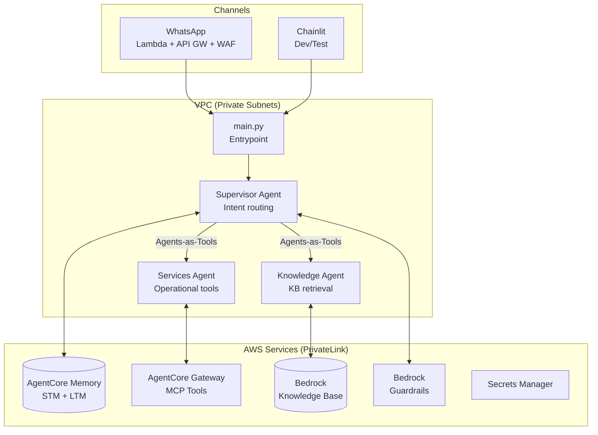

# Conversational Agents

Framework multi-agente domain-agnostic para assistentes conversacionais, construído com [Strands Agents](https://strandsagents.com/) e deployado no [AWS AgentCore Runtime](https://docs.aws.amazon.com/bedrock/agentcore). Configure qualquer domínio (banking, telecom, vendas) via `domains/{slug}/` sem alterar código.

## Arquitetura



**Padrão Agents-as-Tools:** O Supervisor coordena N sub-agents registrados como `@tool`. Cada sub-agent é stateless — memória e contexto ficam centralizados no Supervisor. Adicione quantos sub-agents forem necessários no `domain.yaml` — nomes, descrições e responsabilidades são livres e devem refletir o domínio (vendas, suporte, logística, triagem, etc.).

## Tech Stack

| Componente | Tecnologia |
|---|---|
| Framework de Agentes | Strands Agents SDK |
| Runtime | AWS AgentCore Runtime (ARM64 container) |
| LLM | Claude Sonnet 4.6 + Haiku 4.5 (Bedrock) — model-per-agent via inference profiles |
| Memória | AgentCore Memory (STM + LTM) |
| Knowledge Base | Amazon Bedrock KB |
| Gateway | AgentCore Gateway (MCP) |
| Guardrails | Bedrock Guardrails (prompt attack + topic policy) |
| PII (logs) | `PIIMaskingFilter` regex (CPF, phone, email) |
| Secrets | AWS Secrets Manager (prod) / env vars (dev) |
| Config | Pydantic v2 + YAML |
| Container | Docker ARM64 + UV + OpenTelemetry |
| IaC | Terraform (8 módulos) |
| Network | VPC + VPC Endpoints (PrivateLink) + WAF |
| CI/CD | Bitbucket Pipelines (dev) + GitHub Actions (prod) |
| Testes | pytest — 3 níveis (unit, container, staging) |

---

## How To — Implantando o projeto no BanQi

Guia passo a passo para implantar o assistente BanQi (domínio banking já configurado).

### Pré-requisitos

```bash
python3 --version   # 3.12+
pip install uv
aws sts get-caller-identity
terraform --version  # 1.5+
```

Permissões AWS: `bedrock-agentcore:*`, `bedrock:*`, `iam:CreateRole/PassRole/PutRolePolicy`, `iam:CreateServiceLinkedRole`, `ecr:*`, `logs:*`, `s3:*`, `dynamodb:*`, `lambda:*`, `apigateway:*`.

### Passo 1 — Clone e setup

```bash
git clone <repo-url>
cd conversational-agents
uv venv && source .venv/bin/activate
uv sync
```

### Passo 2 — Configuração

```bash
cp .env.example .env
```

Edite `.env`:

```bash
APP_ENV=staging
DOMAIN_DIR=domains/banqi-banking       # já é o default
AWS_PROFILE=seu-profile
AWS_REGION=us-east-1
AWS_ACCOUNT_ID=123456789012

SUPERVISOR_AGENT_MODEL_ID=us.anthropic.claude-sonnet-4-6
SERVICES_AGENT_MODEL_ID=us.anthropic.claude-haiku-4-5-20251001-v1:0
KNOWLEDGE_AGENT_MODEL_ID=us.anthropic.claude-haiku-4-5-20251001-v1:0
```

Checkpoint (com o venv ativo):

```bash
source .venv/bin/activate
python -c "from src.domain.loader import load_domain_config; print(load_domain_config().domain.name)"
# → BanQi
```

### Passo 3 — Deploy infraestrutura

```bash
cd infrastructure/terraform
cp terraform.tfvars.example terraform.tfvars
```

Edite `terraform.tfvars`:

```hcl
domain_slug    = "banqi-banking"
agent_name     = "banqi_multi_agent"
environment    = "staging"
aws_account_id = "123456789012"
aws_region     = "us-east-1"
memory_name    = "BanQiMemory"

# WhatsApp — use TF_VAR_ env vars para secrets:
#   export TF_VAR_whatsapp_token="..."
#   export TF_VAR_whatsapp_app_secret="..."
```

```bash
terraform init
terraform plan -var image_tag=v1.0.0
terraform apply -var image_tag=v1.0.0
```

O Terraform cria ~36 recursos: ECR + container, AgentCore Runtime/Memory/Gateway, Bedrock KB + S3 + ingestion, Guardrails, IAM roles, Lambda WhatsApp + API Gateway + DynamoDB dedup.

### Passo 4 — Atualizar .env com outputs

```bash
terraform output
# Copie AGENTCORE_MEMORY_ID, BEDROCK_KB_ID, BEDROCK_GUARDRAIL_ID para .env
```

### Passo 5 — Teste local

```bash
cd ../..
source .venv/bin/activate
chainlit run src/channels/chainlit/app.py
# http://localhost:8000
```

### Passo 6 — Configurar WhatsApp

1. Copie `webhook_url` do output do Terraform
2. [Meta Developer Console](https://developers.facebook.com/) → WhatsApp → Configuration → Webhook URL
3. Verify Token: mesmo do `whatsapp_verify_token`
4. Subscribe ao evento `messages`
5. Envie "Olá" pelo WhatsApp → agente responde

> Para o guia completo com troubleshooting, consulte [docs/DEPLOY.md](docs/DEPLOY.md).

---

## How To — Implantando em um Novo Domínio

Para adaptar o framework a outro domínio (vendas, telecom, saúde) **sem alterar código Python**.

### Passo 1 — Copiar template

```bash
cp -r domains/_template domains/brewshop-sales
```

### Passo 2 — Editar `domain.yaml`

```yaml
# domains/brewshop-sales/domain.yaml
domain:
  name: "BrewShop"
  slug: "brewshop-sales"
  description: "Assistente de vendas de bebidas e snacks"

agent:
  name: "brewshop_multi_agent"
  memory_name: "BrewShopMemory"

sub_agents:
  services:
    name: "Services Agent"
    description: "Pedidos, estoque, preços"
    prompt_file: "prompts/services.md"
    tool_docstring: "Processa pedidos e consultas de estoque e preços"
    model_id_env: "SERVICES_AGENT_MODEL_ID"
    tools_source: "gateway_mcp"
  knowledge:
    name: "Knowledge Agent"
    description: "Catálogo de produtos, promoções"
    prompt_file: "prompts/knowledge.md"
    tool_docstring: "Consultas sobre catálogo, promoções e informações gerais"
    model_id_env: "KNOWLEDGE_AGENT_MODEL_ID"
    tools_source: "bedrock_kb"
  # Adicione quantos sub-agents precisar:
  # logistics:
  #   name: "Logistics Agent"
  #   description: "Rastreamento de entregas e rotas"
  #   prompt_file: "prompts/logistics.md"
  #   tool_docstring: "Consulta status de entregas e calcula rotas"
  #   model_id_env: "LOGISTICS_AGENT_MODEL_ID"
  #   tools_source: "gateway_mcp"

interface:
  welcome_message: |
    🍺 Olá! Sou o assistente BrewShop.
    • Fazer pedidos
    • Consultar preços e estoque
    • Ver promoções
```

### Passo 3 — Escrever prompts

Edite os 3 arquivos em `domains/brewshop-sales/prompts/`. Use `domains/banqi-banking/prompts/` como referência.

| Arquivo | O que definir |
|---------|--------------|
| **supervisor.md** | Decision tree de routing, intent patterns, regra de delegação (sub-agents são stateless — enriquecer query com contexto), exemplos de confirmação curta, escopo |
| **services.md** | Workflows operacionais (pedido, estoque, preço), processo de raciocínio, validações |
| **knowledge.md** | Estratégia de busca na KB, como apresentar catálogo, fora de escopo |

> **Dica:** O supervisor.md é o mais importante — ele define a qualidade do routing. Invista tempo nos exemplos few-shot e no decision tree.

### Passo 4 — Adicionar documentos da Knowledge Base

```
domains/brewshop-sales/kb-docs/
├── catalogo-cervejas.md
├── catalogo-snacks.md
├── politica-entrega.md
├── promocoes-vigentes.md
└── faq-pedidos.md
```

Formatos suportados: `.pdf`, `.md`, `.txt`, `.html`, `.docx`, `.csv`.
Documentos são chunked automaticamente pelo Bedrock KB (300 tokens, 20% overlap). O `terraform apply` faz upload para S3 e dispara ingestion.

### Passo 5 — Configurar Gateway Tools

No `terraform.tfvars`, defina as APIs que o Services Agent vai usar:

```hcl
gateway_tools = [
  {
    name        = "get_products"
    description = "Lista produtos disponíveis com preços e estoque"
    lambda_arn  = "arn:aws:lambda:us-east-1:123456789012:function:brewshop-get-products"
  },
  {
    name        = "create_order"
    description = "Cria pedido de compra com itens, quantidades e endereço"
    lambda_arn  = "arn:aws:lambda:us-east-1:123456789012:function:brewshop-create-order"
  },
]
```

> Para PoC sem APIs reais, crie Lambdas mockadas que retornam dados estáticos.

### Passo 6 — Deploy

```bash
export DOMAIN_DIR=domains/brewshop-sales

cd infrastructure/terraform
terraform apply \
  -var domain_slug=brewshop-sales \
  -var agent_name=brewshop_multi_agent \
  -var memory_name=BrewShopMemory \
  -var image_tag=v1.0.0
```

### O que muda vs. o que é framework

```
Muda por domínio (5 arquivos)         Framework (não muda)
─────────────────────────────         ────────────────────
domains/{slug}/domain.yaml            src/  (código Python)
domains/{slug}/prompts/*.md           Dockerfile
domains/{slug}/kb-docs/*              infrastructure/terraform/modules/
terraform.tfvars                      pyproject.toml
Gateway tools (Lambdas do domínio)    tests/ + CI/CD
```

---

## Estrutura do Projeto

```
conversational-agents/
├── domains/
│   ├── banqi-banking/              ← domínio BanQi (referência)
│   │   ├── domain.yaml
│   │   ├── prompts/{supervisor,services,knowledge}.md
│   │   └── kb-docs/ (11 docs)
│   └── _template/                  ← template para novos domínios
│       ├── README.md
│       ├── domain.yaml
│       ├── prompts/{supervisor,services,knowledge}.md
│       └── kb-docs/.gitkeep
├── src/
│   ├── main.py
│   ├── agents/{factory.py, context.py}
│   ├── channels/
│   │   ├── base.py
│   │   ├── whatsapp/{lambda_handler.py, webhook_processor.py, client.py,
│   │   │            agentcore_client.py, signature.py, models.py, config.py}
│   │   └── chainlit/app.py
│   ├── config/settings.py
│   ├── domain/{schema.py, loader.py}
│   ├── gateway/token_manager.py
│   ├── memory/setup.py
│   └── utils/{logging.py, pii.py, validation.py, secrets.py}
├── scripts/{setup.py, setup_memory.py, setup_guardrails.py, delete_user_data.py}
├── infrastructure/
│   ├── terraform/{main.tf, variables.tf, outputs.tf, providers.tf,
│   │              modules/{iam, runtime, memory, gateway, network,
│   │                       guardrails, knowledge_base, whatsapp}/}
│   ├── cloudformation/{template.yaml, network.yaml}
│   └── cdk/{app.py, stacks/}
├── tests/{unit/, integration/, container/, e2e/}
├── Dockerfile
├── docker-compose.yml
├── pyproject.toml
└── .env.example
```

## Testes

```bash
source .venv/bin/activate
pytest -m unit                    # Unit (zero AWS) — cada commit
pytest -m critical                # Critical issues C1-C7
docker compose up -d && bash tests/container/test_health.sh  # Container
pytest -m staging --staging-url=$STAGING_URL                  # E2E staging
```

## Segurança e LGPD

- **Guardrails**: Prompt attack protection (HIGH) + topic policy (off-topic DENY)
- **PII (logs)**: `PIIMaskingFilter` regex — CPF, phone, email mascarados
- **Secrets**: env var (dev) / Secrets Manager (prod), fail-fast sem fallback
- **Network**: VPC privada, 7 VPC Endpoints (PrivateLink), WAF (rate 1000/5min)
- **Container**: Non-root (UID 1000), HEALTHCHECK, ARM64, Trivy scan
- **IAM**: Zero `Resource: '*'` — todos os ARNs scoped
- **LGPD**: `scripts/delete_user_data.py` para direito ao esquecimento (Art. 18)

## Documentação

- [Guia de Deploy detalhado](docs/DEPLOY.md) — Pré-requisitos, scripts de setup, troubleshooting
- [API & Payloads](docs/API_PAYLOADS.md) — Formato de request/response do AgentCore Runtime e WhatsApp webhook
- [Template para novos domínios](domains/_template/README.md) — Quick start em 5 passos
- [HANDOFF](HANDOFF.md) — Estado do projeto, ADRs, próximos passos
- [CHANGELOG](CHANGELOG.md) — Histórico de versões
- [CONTRIBUTING](CONTRIBUTING.md) — Setup, pre-commit hooks, docker-compose, coding standards

## Licença

Propriedade da CI&T. Todos os direitos reservados.
